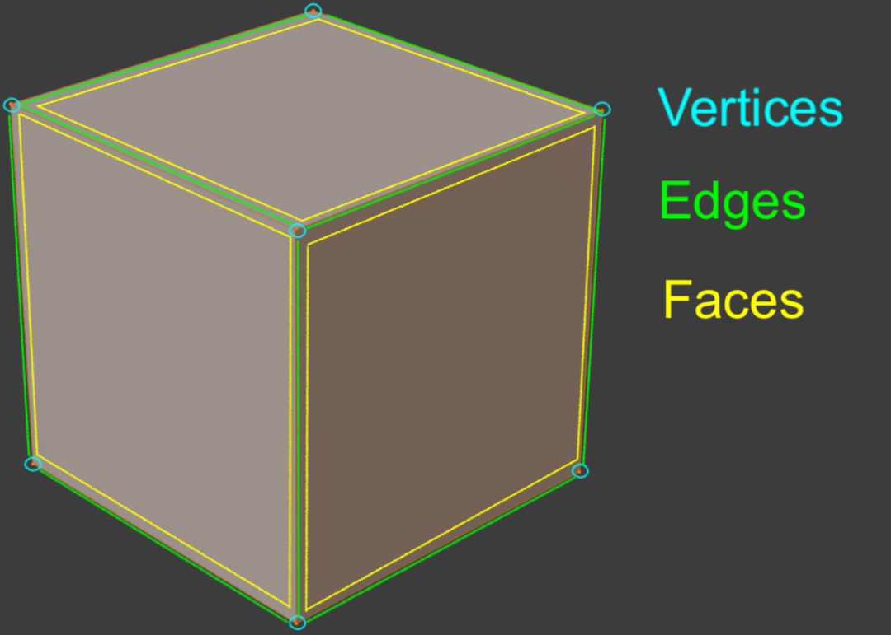
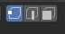
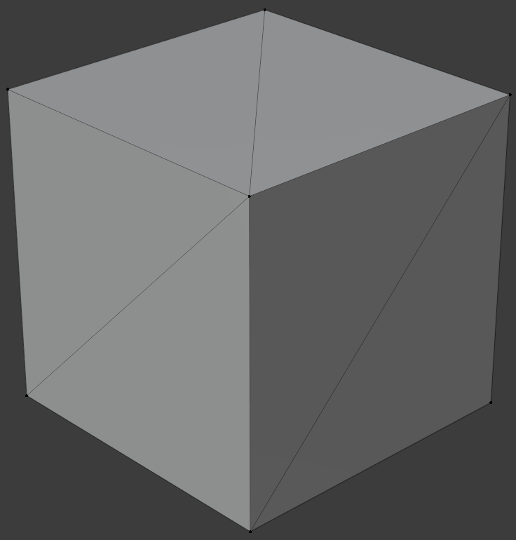

```{r setup, include=FALSE}
knitr::opts_chunk$set(echo = TRUE)
```

# Die verschiedenen Bearbeitungs-Modi

<div class="marginnote"> Object-Mode </div>

Die bisherigen Transformationen, die an Objekten gemacht wurden, haben sich immer auf den Object-Modus bezogen. Dabei wurden grundlegende Eigenschaften von Objekten (Position, Rotation und Skalierung) verändert. Die Form des Objektes selbst wurde dabei nicht verändert, sondern lediglich seine Darstellungsweise. Indem wir die Werte im Sideview wieder alle auf die Ursprungswerte zurücksetzen, erhalten wir das Objekt wieder in seiner originalen Form. Wir können die Werte aber auch wieder eingeben und so beliebige Transformationen machen, welche einfach nachzuvollziehen sind. 
Durch die bisherigen Transformationen haben wird allerdings nur das Objekt als Ganzes bearbeitet. Dies zeichnet die Transformationen im Object-Modus aus. Nebst dem Object-Mode gibt es noch eine Reihe anderer Modi. In der oberen linken Ecke des Viewports ist jeweils ersichtlich, in welchem Modus man sich befindet. Durch einen Klick auf das Drop-Down-Feld erscheint eine Liste der verfügbaren Modi:

<div class="marginnote"> Die verschiedenen Bearbeitungs-Modi </div>

*   **Object-Mode**: In diesem Modus können die Objekte in einer Szene als Ganzes transformiert und angeordnet werden.
*   **Edit Mode**: In diesem Modus können die einzelnen Bestandteile des Objekts anvisiert und bearbeitet werden.
*   **Sculpt Mode**: In diesem Modus kann das Objekt anhand von Sculpting-Tools bearbeitet werden.
*   **Vertex Paint**: In diesem Modus werden einzelne Punkte des Objekts (sogenannte Vertice) angesteuert und mit Attributen versehen.
*   **Weight Paint**: In diesem Modus wird dem Objekt verschiedene Gewichte aufgemalt, so dass anschliessend verschiedene Bestandteile des Objekts unterschiedliche Funktionen erfüllen.
*   **Texture Paint**: In diesem Modus ist es möglich ein Objekt mit einer Textur zu bemalen.

<div class="marginnote"> Wechsel zwischen Object- und Edit-Mode </div>

Im Rahmen dieses Kurses wird vor allem mit dem Object- und dem Edit-Mode gearbeitet. Der Wechsel zwischen diesen beiden Modi stellt allerdings generell einen wichtigen Modi-Wechsel dar. Deshalb ist es auch möglich mittels einer einzigen Taste zwischen diesen beiden Modi hin und her zu wechseln – nämlich mittels der Taste œ. Dabei wird in den Edit-Mode für das aktuell ausgewählte Objekt gewechselt. Für Objekte, welche nicht aus einzelnen Komponenten bestehen (beispielsweise Kameras oder Lichtquellen) ist kein Edit-Mode verfügbar.


::: {.info  data-latex="{info}"}
Das Zurücksetzen der Transformationen kann direkt mittels folgenden Shortcuts erfolgen: 

*   Zurücksetzen der Position: 	<kbd>Alt</kbd> + <kbd>G</kbd>
*   Zurücksetzen der Rotation: 	<kbd>Alt</kbd> + <kbd>R</kbd>
*   Zurücksetzen der Skalierung: 	<kbd>Alt</kbd> + <kbd>S</kbd>

:::

# Struktur von 3D-Meshes

<div class="marginnote"> Der Gitteraufbau von 3D-Meshes </div>

<div style= "float:right;position: relative; padding: 1%; width: 50%; font-size:60%;">
{width=100%}
</div>

Beim Wechseln in den Edit-Mode erscheint das Modell in seiner Struktur bestehend aus mehreren Polygonen. Die Polygone - und somit auch das Modell - besteht in seiner grundlegenden Struktur aus folgenden Elementen:

*   Vertice: Einzelne Punkte in einem Mesh
*   Edges: Linien zwischen zwei Vertices in einem Mesh
*   Faces: Flächen zwischen mehreren Edges/Vertices in einem Mesh

<div class="marginnote"> Select-Modus wechseln </div>

<div style= "float:right;position: relative; padding: 1%; width: 25%; font-size:60%;">
{width=100%}
</div>

Im Edit-Mode kann jeweils eines der drei Elemente ausgewählt werden, je nachdem in welchem Select-Modus man sich befindet. Die drei Select-Modi sind in der linken oberen Ecke, direkt neben dem Auswahlfeld für den Bearbeitungs-Modi (in dem Falle der Edit-Mode) aufzufinden.

## Vertices

<div class="marginnote"> Vertices </div>

Ein Vertex (Mehrzahl: Vertice) stellt die grundlegendste Einheit in einem Mesh dar. Jeder Vertex beschreibt einen Punkt in einem Mesh dar. Anders als die Objekte selbst, beinhalten Vertices nur das Merkmal Position. Die Merkmale Skalierung und Rotation gibt es für Vertices nicht. Ein Vertex hat deshalb auch keine Dimensionen.


<div class="marginnote"> Auswahl von Vertices </div>

Werden zwei miteinander verbundene Vertices ausgewählt, so wird automatisch auch das dazwischen liegende Edge ausgewählt. Ebenso wird automatisch das dazugehörige Face mit ausgewählt, wenn alle Vertices dieses Faces ausgewählt werden. Ein einzelner Vertex kann allerdings nur im Vertex-Select-Mode angewählt werden.


## Edges

<div class="marginnote"> Edges </div>

Edges beschreiben Linien, welche zwischen zwei Vertices liegen. Da ein Edge genau der Verbindung zwischen zwei Vertices entspricht ist dessen Mittelpunkt identisch zur Mitte zwischen den beiden Vertices.

<div class="marginnote"> Auswahl von Edges </div>

Im Edge-Select-Modus können die Edges als solche ausgewählt werden. Dabei werden automatisch auch die beiden zum Edge dazugehörigen Vertices ausgewählt. Wenn alle Edges eines Faces ausgewählt werden, dann wird automatisch auch das dazugehörige Face ausgewählt.


## Faces

<div class="marginnote"> Faces </div>

Faces stellen die Fläche zwischen verbundenen Edges/Vertices dar. Die Position des Faces entspricht dem Mittelpunkt dieser Fläche und somit dem Mittelpunkt der dazugehörigen Vertice. 
Mittels dem Face-Select-Modus können Faces direkt angewählt werden. Alternativ kann ein Face auch angewählt werden, indem im Vertex-Select-Modus alle zum Face dazugehörigen Vertices ausgewählt werden, oder indem im Edge-Select-Modus alle zum Face dazugehörigen Vertices ausgewählt werden.

# Anzahl Vertices in einem Face

<div class="marginnote"> Anzahl Vertices in einem Face </div>

Der Default-Cube, den Blender jeweils beim Start eines neuen Projektes zur Verfügung stellt besteht aus 6 Faces. Jedes dieser Faces beinhaltet vier Vertices. Es ist allerdings auch möglich, dass ein Face aus mehr oder weniger Vertices besteht. Es gibt verschiedene Begriffe, basierend auf der Anzahl Vertices in einem Face:

<div class="marginnote"> Bezeichnung von Faces aufgrund Anzahl Vertices </div>

*   **Triangles** (**Tris**): bestehen aus drei Vertices
*   **Quadrangles** (**Quads**): Bestehen aus vier Vertices
*   **N-Gons**: Bestehen aus n Vertices


::: {.info  data-latex="{info}"}
Polygone und Faces sind in ihrer Bedeutung praktisch deckungsgleich. In der genaueren Betrachtung beschreiben die Faces allerdings spezifischer die Flächen als solche, während die Polygone eher die Gesamtheit von Faces, Edges und Vertices beschreiben.
:::

<div class="marginnote"> Tris aus Quads ableiten </div>

<div style= "float:right;position: relative; padding: 1%; width: 35%; font-size:60%;">
{width=100%}
</div>

Aus Quads lassen sich sehr einfach Tris bilden. Hierfür muss lediglich jedes Quad zwischen zwei gegenüberliegenden Vertices zerschnitten werden. Somit wird also jede Fläche in zwei Dreiecke unterteil. Beim Rendern von Bildern anhand der Objekte werden Quads sogar automatisch in Tris unterteilt. Im Normalfall ist dies für den Benutzer allerdings kaum ersichtlich.


<div class="marginnote"> Bevorzugung von Quads </div>

Trotzdem ist es sinnvoll sich beim Modellieren von 3D-Objekten eher an die Verwendung von Quads zu gewöhnen. Viele Tricks und Kniffe der Objektbearbeitung lassen sich einfacher auf Quads anwenden oder teilweise gar nicht auf Tris. Somit erleichtert die Arbeit mit Quads den Arbeitsprozess erheblich. Weiterhin sind Quads auch in vielen Animationsstudios der Standard.

<div class="marginnote"> Anwendung von Tris </div>

Arbeiten mit Tris ist trotzdem durchaus möglich. Zudem ist es auch nicht problematisch, wenn in einem 3D-Objekt vereinzelte Tris auftauchen. In manchen Situationen sind Tris allerdings auch flexibler als Quads. Wenn allerdings die Objekte komplett aus Tris bestehen sollen, macht dies gerade in gemeinschaftlichen Prozessen nur Sinn, wenn alle beteiligten Personen mit Tris umgehen können. 


::: {.remember  data-latex="{remember}"}

# Merke…
*   Vertices beschreiben die einzelnen Punkte in einem 3D-Objekt
*   Edges beschreiben die verbundenen Punkte in einem 3D-Objekt
*   Faces beschreiben verbundene Flächen zwischen mehr als zwei Vertices
*   Faces mit vier Vertices (Quads) sind zu bevorzugen

:::

 
# Auswahl von Vertices, Edges und Faces im Edit-Mode

<div class="marginnote"> Auswahl von Vertices, Edges und Faces im Edit-Mode </div>

Abhängig davon, welcher Select-Mode gerade aktiviert ist, lassen sich entweder die Vertices, die Edges oder Faces auswählen. Die Auswahl der jeweiligen Elemente geschieht mittels der linken Maustaste. Wie auch im Object-Mode können mittels gedrückter <kbd>Shift</kbd> Taste zusätzliche Elemente ausgewählt werden. Ebenso kann mit der Taste <kbd>C</kbd> der Circle-Select-Mode und mittels der Taste <kbd>B</kbd> der Box-Select-Mode verwendet werden. Zudem kann mit der Tastenkombination <kbd>Cmd</kbd> + <kbd>I</kbd> die Auswahl umgekehrt werden.

<div class="marginnote"> Select linked mittels <kbd>L</kbd> </div>

Im Edit-Modus gibt es zudem noch einige zusätzliche Auswahl-Optionen. Wenn sich die Maus über einem Element eines Objekts befindet kann mit der Taste <kbd>L</kbd> beispielsweise alle Elemente, welche direkt über Edges damit verbunden sind ausgewählt werden. Dies ermöglich es, alle verbundenen Elemente auszuwählen. Um auch unverbundene Elemente eines Objektes auszuwählen kann die Taste <kbd>A</kbd> gedrückt werden.

<div class="marginnote"> Edge-Loop-Select bei gedrückter Taste <kbd>Alt</kbd> </div>

Zudem lassen sich auch ganze Verbindungen von Edges auswählen, wenn die Taste <kbd>Alt</kbd> während der Auswahl gedrückt wird. Dadurch werden alle Edges, die gemeinsam eine Linie bilden ausgewählt. Dies ist auch im Vertex Select-Modus möglich. Im Face-Select-Modus werden alle Faces, die gemeinsam eine Linie bilden ausgewählt (hierfür muss der Mausklick allerdings bei einem Edge erfolgen – nicht in der Fläche des Faces).

# Das Innere des Objekts

<div class="marginnote"> Virtuelle Objekte haben meist keine Füllung </div>

So wie auch in der realen Welt haben virtuelle 3D-Objekte Flächen, welche aus mindestens drei Seiten bestehen und mindestens drei Ecken. Im Gegensatz zu Objekten in der realen Welt, bestehen virtuelle Objekte allerdings aus keiner Füllung. Wenn wir also in der realen Welt einen Apfel mit einem Messer in der Mitte teilen, so sehen wir was sich unter der Schale befindet, etwa das Fruchtfleisch oder der Kern. Wenn wir ein 3D-Mesh in der Hälfte trennen und auseinanderziehen, befindet sich darin nichts. Es besteht somit lediglich aus der Oberfläche der Objekte, welche auch sichtbar ist. Anhand der gewohnten Form stellen wir uns anschliessend den Inhalt vor.

<div class="marginnote"> Wenn das Innere Sichtbar wird </div>

In Videospielen kann es vereinzelt vorkommen, dass die Kamera durch einen Fehler in ein Objekt hineingelangt. Dabei sieht man anschliessend dieses Objekt von der Innenseite. In manchen Fällen ist es allerdings auch so, dass das entsprechende Objekt schlicht von der Innenseite aus nicht mehr sichtbar ist.

# Normalen: die richtige Seite der Faces finden

<div class="marginnote"> Die zwei Seiten von Faces </div>

Da 3D-Meshes keinen inneren Hohlraum haben, bilden die Faces die Oberfläche, welche das Objekt abdecken. Dies bedeutet aber auch, dass es zwei Seiten gibt: Eine Oberfläche, die betrachtet werden soll und eine nicht zu betrachtende Rückseite. In den meisten Fällen ist schnell klar, welche Seite eines Objektes von Bedeutung ist. Einen Apfel betrachtet man jeweils von aussen, also ist die nach aussen gerichtete Seite jene Seite, welche betrachtet werden soll. Ebenso verhält es sich bei einer Tasse. In diesem Falle ist ebenfalls die nach aussen gerichtete Seite von Bedeutung.

<div class="marginnote"> Die zu betrachtende Seite eines Würfels </div>

Wie verhält es sich bei Blenders Standard-Würfel? Auch bei diesem sind die Normalen nach aussen gerichtet. Die Platzierung der Kamera in der Default-Szene legt diese Einstellung auch nahe. Allerdings wäre es auch möglich, dass der Default-Cube von innen betrachtet werden soll – etwa, wenn eine Szene im inneren eines Raumes dargestellt werden soll und der Würfel die Wände, den Boden und die Decke des Raumes darstellt. In diesem Falle ist nicht mehr die Aussenseite des Würfels von Bedeutung, sondern die Innenseite.

<div class="marginnote"> Normalen </div>

Um mit dieser Problematik umgehen zu können, verfügen 3D-Objekte über die sogenannten Normalen. Die Normalen geben jeweils an, in welche Richtung Vertice, Edges und Faces gerichtet sind. Wenn ein Würfel etwa von innen betrachtet werden soll, müssen die Normalen nach innen gekehrt werden. Wenn der Würfel allerdings als solches von aussen betrachtet werden soll, dann müssen die Normalen nach aussen gekehrt sein.

<div class="marginnote"> Normalen darstellen </div>

Die Normalen eines 3D-Objektes lassen sich lediglich in der Edit-View betrachten. Ihre Ansicht muss allerdings zusätzlich aktiviert oh werden. Dies wird im Overlay-Drop-Down-Menü in der rechten oberen Ecke, unter dem Menü Normals aktiviert. Anschliessend erscheinen in den Faces kleine blaue Striche, welche in diejenige Richtung zeigen, gegen die das Face dargestellt ist. 

<div class="marginnote"> Normalen umkehren und neu berechnen </div>

Wenn alle Faces innerhalb eines Objekts ausgewählt werden, mittels der Taste <kbd>A</kbd>, kann anschliessend mittels der Tastenkombination <kbd>Alt</kbd> + <kbd>N</kbd> das Normals-Menü bei der Maus geöffnet werden. Unter der Option «Flip» können anschliessend alle Normals in die umgekehrte Richtung gekehrt werden. Zudem können die Normals hier auch mittels der Option «Recalculate Outside» zur äusseren Seite hin berechnet werden oder mittels «Reculaculate Inside» zur inneren Seite hin berechnet werden.

::: {.info  data-latex="{info}"}
Je nach Einstellungen von Game-Engines oder Materialien kann es sein, dass die Rückseite gar nicht dargestellt wird. In diesem Falle würde man durch die Seiten, auf der sich keine Normalen befinden durchschauen und das andere Ende des Objektes an dieser Stelle sehen, da dort die Normalen auf die eigene Ansicht hin zugewendet sind.
:::