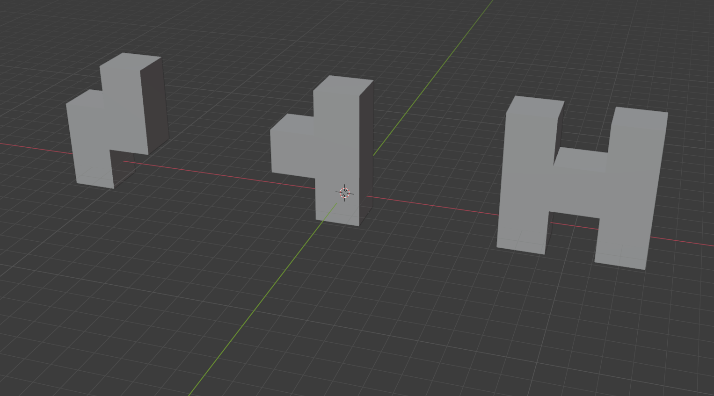
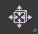
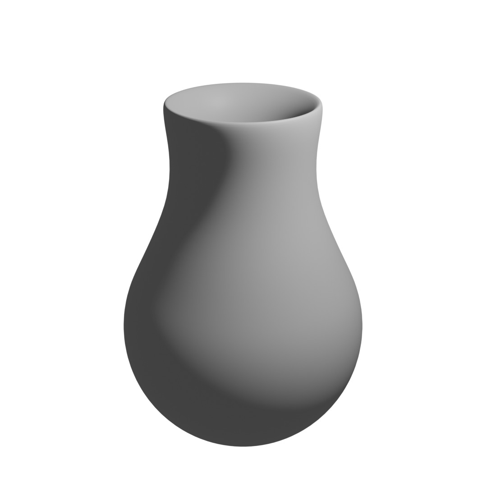

```{r setup, include=FALSE}
knitr::opts_chunk$set(echo = TRUE)
```


# Fill

<div class="marginnote"> Elemente verbinden mittels F </div>

Wie bereits angesprochen können Elemente mittels der Taste D dupliziert werden und an einer anderen Stelle platziert werden. Diese neuen Elemente sind allerdings durch keine Edges und Faces mit der originalen Struktur verbunden. Hierfür kann der Befehl «Fill» benutzt werden, um Elemente zu verbinden. 
Mittels der Taste F lässt sich der Befehl «Fill» verwenden. Werden etwa zwei einzelne Vertices ausgewählt, werden diese mittels der Taste F durch ein Edge verbunden. Werden drei einzelne Vertices ausgewählt, werden diese nicht nur durch ein Edge verbunden, sondern zugleich auch mit einem Face.

# Extrude

{width=15%}


<div class="marginnote"> Extrudieren mittels E </div>

Wenn Elemente dupliziert werden, wird jeweils die Fill-Funktion verwendet, um sie wieder mit ihren ursprünglichen Elementen zu verwenden. Dies ist beschwerlich. Zudem muss auch darauf geachtet werden, dass allfällige innere Faces wieder entfernt werden. Deshalb wird selten mit dem Duplizieren gearbeitet, sondern mit der Funktion «Extrude». Diese Funktion ist in der Toolbar verfügbar, kann aber auch direkt mit der Taste E ausgewählt werden.

<div class="marginnote"> Extrusion verbindet Elemente direkt </div>

Beim Extrudieren von Elementen werden diese Elemente nicht nur dupliziert, sondern auch automatisch mit den originalen Elementen verbunden. Wird beispielsweise bei der Auswahl eines Faces die Taste E gedrückt, wird dieses Face von der originalen Position gelöst und kann verschoben werden. Gleichzeitig ist es allerdings über weitere Faces noch mit den Vertices des originalen Faces verbunden. Beim Extrudieren werden also die ausgewählten Elemente aus dem Objekt herausgezogen, ohne die originalen Vertices zu löschen.

<div class="marginnote"> Beim Extrudieren erzeugte Elemente </div>

Nebst Faces lassen sich auch Vertices und Edges extrudieren. Wenn ein einzelner Vertex extrudiert wird, generiert Blender automatisch ein Edge zwischen dem originalen Vertex und dem extrudierten Vertex. Wenn ein Edge extrudiert wird generiert Blender automatisch ein Face zwischen dem originalen Edge und dem neuen Edge. Wird ein Face extrudiert, werden automatisch Faces zwischen den originalen Vertices/Edges und den neuen Vertices/Edges erstellt.

<div class="marginnote"> Extrudieren präzisieren </div>

Wie auch beim Duplizieren kann die Extrusion mittels der Tasten X, Y oder z auf einzelne Achsen beschränkt werden und mittels der Angabe von Zahlen angegeben werden, wie gross die Distanz zum originalen Median der Auswahl sein soll. Zudem kann das Extrudieren auch mittels der Taste S mit einer Skalierung verbunden werden. 

<div class="marginnote"> Faces werden per Default entlang Normalen extrudiert </div>

Beim Extrudieren von Faces erfolgt die Bearbeitung per Default entlang der Normalen des Faces. Dadurch wird automatisch entlang der Ausrichtung der Faces extrudiert. Dies ist bei Vertices und Edges nicht der Fall.

::: {.exercise  data-latex="{exercise}"}

# Übung 6: Extrudieren
## Übung 6.1 
Erstellen Sie folgende Objekte ausgehend von einem Würfel.
{width=50%}
:::

# Knife
{width=15%}

<div class="marginnote"> Schneiden </div>

Es ist möglich Faces und Edges mittels des Befehles «Knife» zu verschneiden. Dadurch resultieren neue Vertices innerhalb von Flächen und Kanten. Diese Operation lässt sich ebenfalls in der Toolbar auswählen. Allerdings ist es auch möglich mittels der Taste K diese Operation direkt auf der Tastatur anzuwählen.

<div class="marginnote"> Ansicht im Schnitt-Modus </div>

Sobald das Knife-Werkzeug über die Toolbar oder die Taste K aktiviert wird, verwandelt sich der Maus-Cursor in ein Messer. Wird die Maus nun über das Objekt bewegt, wird mittels eines grünen Vierecks angezeigt, an welcher Stelle am Objekt gerade geschnitten werden kann. Befindet sich an dieser Stelle zudem ein Vertex wird dies durch eine rote Umrandung des grünen Vierecks signalisiert. Befindet sich das grüne Viereck an einem Edge, wird dieses Edge grün markiert.

<div class="marginnote"> Schnitte setzen </div>

Um Schnitte zu platzieren, wird die † gedrückt. Die Schnittpositionen werden anhand eines Vierecks markiert und weitere Schnitte können ebenfalls mit der † an der entsprechenden Position gesetzt werden. Dabei werden automatisch die Edges zwischen den einzelnen Schnittpunkten erzeugt. Passieren Schnittpunkte ein Edge, wird an der Schnittstelle des Edges zudem automatisch ein Vertex erzeugt.

<div class="marginnote"> Schnitte bestätigen oder abbrechen </div>

Mittels der Taste √ oder ¶ wird der Schneidevorgang bestätigt. Dadurch wird der Schneidmodus verlassen und die entsprechenden Vertices und Edges. Um den Schneideprozess abzubrechen kann die Ω oder € gedrückt werden.

# Loop Cut

{width=15%}

<div class="marginnote"> Prinzip des Loop Cuts </div>

Das Messer-Werkzeug ist nützlich, um kreativ und flexibel Schnitte zu erzeugen. Oftmals werden allerdings gerade Schnitte entlang einer ganzen Fläche benötigt, idealerweise auch gerade in der Mitte. Hierfür ist das Loop-Cut-Werkzeug geeignet. Nebst der exakten Mitte können auch andere Schnitteinheiten exakt berücksichtig werden, wie etwa beispielsweise, dass ein Bereich exakt nach einem Zehntel der Länge geschnitten werden soll.

<div class="marginnote"> Loop Cut mittels ≈+R </div>

Das Loop Cut Tool kann entweder in der Toolbar oder mittels der Tastenkombination ≈+R aktiviert werden. Wird anschliessend über die Maus über die Oberfläche des Cursors gerichtet werden Vorschläge dargestellt, wie das Objekt gerade durchtrennt werden kann. Dabei werden Faces, die aneinander liegen als Reihe Loop berücksichtig, so dass sie durchtrennt werden können.

<div class="marginnote"> Mehrere Schnitte im Loop Cut setzen </div>

Es können auch mehrere Schnitte entlang der Linie gemacht werden. Hierfür wird die Anzahl Schnitte als Zahl über die Tastatur eingegeben werden. So kann etwa der Standardwürfel entlang einer Flächenreihe in drei gleichgrosse Flächen unterteilt werden, indem die Taste 3 gedrückt wird und anschliessend die Zahl 2 eingegeben wird. Dadurch werden zwei Linien angezeigt, welche den Bereich in gleich grosse Teile unterteilt.

<div class="marginnote"> Loop Cut bestätigen oder abbrechen </div>

Durch einen Klick mit der † oder ¶ wird bestätigt, dass das Objekt entlang der dargestellten Linie zerschnitten werden soll. Um den Schneideprozess abzubrechen kann Ω, ‘ oder € gedrückt werden.

<div class="marginnote"> Loop Cut justieren </div>

Wenn die Auswahl der Linie bestätigt wird, kann anschliessend noch justiert werden, in welchem Bereich der Schnitt geschehen soll. Per Default liegt der Schnitt genau in der Mitte. Mittels einer Bewegung mit dem Mauscursor kann der Schnitt noch entlang des Loops verschoben werden. Alternativ kann auch mittels einer Zahleneingabe über die Tastatur definiert werden, in welchem Bereich der Schnitt erfolgen soll. Mit einem Wert von 0.5 wird ein einzelner Schnitt dadurch etwa im prozentual um die Hälfte, in die gegen die eine Richtung verschoben, mit einem Wert von -0.5 wird der Schnitt prozentual in die Hälfte in die andere Richtung verschoben. Durch einen Klick mit der † oder ¶ wird die Linie bestätigt und die Schnitte werden gesetzt. Durch das Drücken der  ‘ oder € wird der Schnitt in der Mitte des Loops vollzogen.

::: {.info  data-latex="{info}"}
Der Loop-Cut kann auch auf Edges angewendet werden, die noch nicht Teil eines Faces sind. Dabei wird das Edge genau in der Mitte durch einen Vertex in zwei Edges unterteilt
:::

# Edge Slide

{width=15%}

<div class="marginnote"> Edge Slide </div>

Der Loop Cut beinhaltet eigentlich zwei Prozesse: Die Festlegung eines Schnittes innerhalb eines Loops und zusätzlich die Festlegung in welchem Bereich des Face-Loops der Cut erfolgen soll. Letzterer Prozess kann bei der Auswahl eines Loops an Edges direkt erfolgen. Dieser Prozess wird als Edge Slide bezeichnet und kann in der Toolbar aktiviert werden.

#Subdivide

<div class="marginnote"> Unterteilung mittels Loop Cut </div>

Dank des Loop-Cuts ist es möglich, dass der Standardwürfel in gleich grosse Unterwürfel unterteilt wird. Hierfür muss lediglich auf alle drei Loops des Würfels ein Cut angewendet werden. Anschliessend ist jede Seite des Würfels in vier Faces unterteilt.

<div class="marginnote"> Subdivision um Objekte zu unterteilen </div>

Statt alle drei Loop Cuts einzeln machen zu müssen kann der Würfel auch unterteilt werden mittels des Befehles «Subdivide». Dieser ist über das Menü «Edge | Subdivide» verfügbar. Anschliessend werden alle ausgewählten Faces entlang zweier Achsen unterteilt, so dass sie aus vier einzelnen Faces bestehen. Im Kontext-Menü zur letzten durchgeführten Aktion kann zudem die Anzahl Unterteilungen erhöht werden.

# Bevel
{width=15%}

<div class="marginnote"> Abrunden mittels B </div>

Mithilfe der Bevel-Transformation können Kanten abgerundet werden. Hierfür wird das entsprechende Edge durch mehrere Edges ersetzt, so dass eine Abrundung der Kante erfolgen kann. Der Befehl für das Abschrägen kann über die Toolbar erfolgen oder mittels der Taste B.

<div class="marginnote"> Abrundung durchführen </div>

Um eine Kante abrunden zu können muss das entsprechende Edge zunächst ausgewählt werden. Nach der Auswahl kann die Bearbeitung mit der Taste B gestartet werden. Dadurch erscheint am Maus-Cursor ein Faden, welcher zum Median der Auswahl führt. Durch das Entfernen des Mauscursors vom Median weg werden die ausgewählten Edges in je zwei Edge aufgeteilt, die sich von den originalen Edges wegentfernen und dabei eine Abrundung bilden. Durch einen Klick mit der † oder ¶ wird die Abrundung zu einer bestimmten Position bestätigt. Durch das Drücken der Ω, ‘ oder € wird der Vorgang abgebrochen.

<div class="marginnote"> Abrundung verfeinern </div>

Im Kontext-Menü zur letzten durchgeführten Aktion sind jeweils weitere Optionen zur Transformation möglich. So können die Anzahl Segmente, mit der die Abrundung erfolgt noch erhöht werden. Je mehr Segmente, desto glatter wirkt die Abrundung. Zudem kann auch noch die Form anhand des Faktors für den «Shape» bearbeitet werden. Je näher dieser Faktor gegen 0 strebt, desto mehr erfolgt die Abrundung zum Inneren des Objektes, und je näher der Faktor gegen 1 strebt, desto mehr erfolgt die Abrundung zum Äusseren des Objektes.

<div class="marginnote"> Vertices abrunden </div>

Die Bevel-Transformation kann sowohl für Edges als auch für Vertices angewendet werden. Wenn etwa ein Objekt lediglich aus einer Fläche besteht und die Ecken dieser Fläche bearbeitet werden, wird die Bevel-Transformation auf die Vertices in den Ecken angewendet. In diesem Falle muss im Kontext-Menü zur letzten durchgeführten Aktion eingestellt werden, dass die Vertices bearbeitet werden anstelle der Edges. Hierfür wird unter der Zeile «Affect» Vertices ausgewählt. Bei der Bearbeitung von Kanten zwischen mehreren Faces werden jeweils die Edges der Bevel-Transformation unterzogen, so dass die Zeile «Affect» auf Edges gestellt werden muss.

# Inset Faces
{width=15%}

<div class="marginnote"> Intrusion mittels I </div>

Die Transformation Inset Faces stellt einen Spezialfall der Extrusion dar. Dabei wird eine Fläche unterteilt in zusätzliche Flächen darin. Wie auch bei der Extrusion werden dabei neue Vertices erstellt, welche direkt an den originalen Vertices andocken. Unterschiedlich ist allerdings, dass die neuen Vertices einen Teil der originalen Faces darstellen und somit deren Position innerhalb dieser Faces liegen muss. Die Bearbeitung mittels Inset Faces kann entweder über die Toolbar oder mittels der Taste I erfolgen.

<div class="marginnote"> Intrusion durchführen </div>

Um die Bearbeitung zu starten, muss mindestens ein Face ausgewählt werden und anschliessend die Taste I gedrückt werden. Wie auch beim Skalieren von Elementen ist der Mauscursors nun mittels eines Fadens zum Median der Auswahl verbunden. Wenn die Maus nun näher zum Median hin bewegt wird, erscheinen zusätzliche Faces innerhalb der Auswahl, die jeweils kleiner werden, je näher der Cursor dem Median kommt.

<div class="marginnote"> Dicke der Intrusion </div>

Die Intrusion wird anhand der Dicke der neu erstellten Faces beschrieben. Wird beispielsweise nach dem Drücken der Taste I die Taste 1 gedrückt, sind die neuen Faces jeweils um einen Meter von ihren alten Faces entfernt. Durch zu hohe Zahlen kann dies dazu führen, dass sich die Faces in sich kreuzen.

<div class="marginnote"> Individuelle Intrusion </div>

Die Funktion Inset Faces kann zudem auch auf die Faces individuell angewendet werden. Im Normallfall werden zwei nebeneinander ausgewählte Faces gemeinsam bearbeitet. Es ist jedoch auch möglich die Faces individuell anzusteuern, so dass die ausgewählten Faces individuell bearbeitet werden. Hierfür muss im Kontext-Menü zur letzten durchgeführten Aktion die Option «Individual» angewählt werden.

# Spin
{width=15%}

<div class="marginnote"> Spin </div>

Mittels Spin können einzelne oder mehrere Vertices in einer kreisförmigen Anordnung extrudiert werden. Wenn diese Transformation ausgewählt ist, erscheint in der Nähe des 3D-Cursors ein Gizmo, welches eine abgerundete Linie, mit einem Plus-Symbol an beiden Enden. Falls dieses Gizmo nicht angezeigt wird, sollte überprüft werden, ob die Darstellung der Gizmos im 3D-Viewport aktiviert ist.

<div class="marginnote"> Spin durchführen </div>

Um Vertices nun kreisförmig zu extrudieren, müssen Sie zunächst ausgewählt werden. Anschliessend kann an einem der beiden Pluszeichen gezogen werden und das Vertices wird kreisförmig um den 3D-Cursor herum extrudiert. Dabei werden per Default 12 Vertices erstellt – unabhängig davon, wie weit im Kreis extrudiert wird.

<div class="marginnote"> Spin verfeinern </div>

Im Kontext-Menü zur letzten durchgeführten Aktion kann die Aktion noch bearbeitet werden, so dass etwa die Anzahl extrudierter Vertices unter «Steps» verändert werden kann. Je mehr Vertices extrudiert werden, desto glatter wirkt der Kreis. Unter «Angle» kann mittels einer Winkelangabe eingestellt werden, wie weit herum die Extrusion erfolgen soll. Wenn die Zeile «Auto Merge» aktiviert ist, werden Vertices an derselben Position – beispielsweise die Vertices am Start und Ende einer 360° Umdrehung – zu einem Vertex kombiniert.

# Merge

<div class="marginnote"> Verbinden mittels M </div>

In den bisherigen Transformationen wurden jeweils neue Vertice, Edges oder Faces hinzugefügt. Manchmal kommt es vor, dass einige Elemente wieder entfernt werden müssen, oder dass sie an einer Stelle verbunden werden müssen. Hierfür kann der Befehl «Merge» verwendet werden. Dieser lässt sich mittels der Taste M innerhalb eines Kontextmenüs bei der Maus auswählen.

<div class="marginnote"> Elemente im Median verbinden </div>

Wenn beispielsweise zwei Vertices ausgewählt werden und die Taste M gedrückt wird, können die Vertices durch «At Center» beim Median zwischen den beiden Vertices verbunden werden. Dabei werden die beiden Vertices zusammengeführt zu einem Vertex, welches alle Edges und Faces der originalen Vertices aufnimmt. Das Mergen kann zudem mit beliebig vielen Vertices vollzogen werden. Bei der Auswahl von Edges und Faces werden dabei die beteiligten Vertices zur Zusammenführung verwendet.

<div class="marginnote"> Andere Verbindungs-Punkte </div>

Nebst dem Medianpunkt der Vertices können auch folgende Positionen zur Zusammenführung ausgewählt werden:

*   **At Cursor**: Die Vertices werden an der Position des 3D-Cursors zusammengeführt.
*   **At First**: Die Vertices werden beim Vertex, welcher als erstes ausgewählt wurde, zusammengeführt.
*   **At Last**: Die Vertices werden beim Vertex, welcher als letztes ausgewählt wurde, zusammengeführt.
*   **Collapse**: Wenn mehrere Edges ausgewählt werden, die nicht miteinander verbunden sind, werden die Vertices jeweils in der Mitte des jeweiligen Edges zusammengeführt. Das Zusammenführen erfolgt also hierbei einzeln für jedes Edge in dessen Mitte (bei den anderen Optionen werden alle Vertices an demselben Punkt zusammengeführt).

<div class="marginnote"> Merge by Distance </div>

Eine besondere Rolle kommt der Funktion «Merge by Distance» zu. Dabei werden alle Vertices zusammen verbunden, deren Distanz geringer als die vorgegebene Distanz ist. Im Kontext-Menü zur letzten Aktion lässt sich die Distanz, unterhalb derer alle Vertices verbunden werden sollen anpassen. In der Die Funktion wird allerdings nur auf die ausgewählten Vertices angewendet. In der Fussleiste von Blender wird temporär angegeben, wie viele Vertices bei dieser Aktion aufgelöst werden.

<div class="marginnote"> Merge erfolgt nur auf Auswahl </div>

Diese Methode ist besonders geeignet um allfällige Vertices, welche an derselben Position wie andere Vertices liegen zu eliminieren oder zu verbinden. Da die Aktion allerdings nur auf ausgewählte Vertices angewendet wird, empfiehlt es sich vorgängig alle Vertices direkt mit der Taste A auszuwählen.

# Weitere Operationen in der Toolbar
Nebst den bisher behandelten Operationen zur Objektbearbeitung im Edit-Mode bietet die Toolbar noch eine Reihe weiterer Optionen, welche der Vollständigkeit halber noch kurz aufgeführt werden.

## Add Cube
{width=15%}

<div class="marginnote"> Würfel hinzufügen </div>

Mittels des Befehles «Add Cube» kann ein neuer Würfel erstellt werden. Um den Mauscursor erscheint dabei ein Gitternetz, um zu signalisieren, wo der Würfel erstellt wird. Anschliessend kann mittels gedrückter † der Grundriss des Würfels erstellt werden. Nachdem † die losgelassen wurde lässt sich anschliessend noch die Höhe des Würfels einstellen, welche anschliessend mit † bestätigt werden muss. Mit € oder Ω lässt sich der Vorgang abbrechen. 
Die neu erstellten Würfel werden im Edit Mode zu Bestandteilen des Objekts, welches gerade bearbeitet werden. Der Befehl «Add Cube» steht allerdings auch im Object-Mode zur Verfügung. Werden dort neue Würfel erstellt bilden diese jeweils eigenständige Objekte.

## Smooth
{width=15%}

<div class="marginnote"> Objekte glätten </div>

Mittels dem Befehl Smooth können Objekte glatter gemacht werde. Dies geschieht, indem die Winkel der Edges gemittelt werden. Statt eines 90° Winkels entsteht dann ein geringerer Winkel.

## Shrink/Fatten
{width=15%}

<div class="marginnote"> Objekte zusammenziehen oder aufblähen </div>

Beim Befehl «Shrink/Fatten» werden die ausgewählten Vertices entlang ihrer eigenen Normalen bewegt. Dadurch kann das Objekt aufgebläht oder zusammengezogen werden. Dies ist beispielsweise nützlich, wenn der Mantel eines Zylinders ausgewählt und sein Radius vergrössert werden soll, ohne dessen Höhe zu verändern.

## Shear
{width=15%}

<div class="marginnote"> Objekte auseinanderziehen </div>

Mittels der Shear-Transformation werden die ausgewählten Punkte in einer Achse auseinandergezogen. Die Transformation geschieht dabei so, dass parallel verlaufende Linien geschert werden und praktisch nebeneinander vorbeiziehen.

## Rip Region
{width=15%}

<div class="marginnote"> Regionen aufteilen </div>

Mittels des Befehls “Rip Region” können Vertice, welche an mehreren Faces andocken aufgeteilt werden. Die Faces werden dabei an der Stelle der entsprechenden Vertices getrennt und werden durch Vertice, welche sozusagen von den originalen Vertices abgezogen werden, neu gebildet.

## Poly Build
{width=15%}

<div class="marginnote"> Poly Build Modus </div>

Beim Poly Build handelt es sich um einen interaktiven Modus um Geometrien zu erweitern. Dabei schlägt Blender bei gedrückter ≈ Taste vor, wie neue Elemente erstellt werden können und durch einen Klick mittels † wird die Erstellung bestätigt. Mittels der Kombination ƒ+† können Vertices gelöscht werden und mittels der † bewegt werden.

::: {.exercise  data-latex="{exercise}"}

# Übung 7: Objektbearbeitung

## Übung 7.1  

Verändern Sie den Standardwürfel im Edit-Mode so, dass er die Form eines Hauses hat.
{width=15%}


## Übung 7.2 Leistungsnachweis 2

Erstellen Sie eine Vase. Die Vase sollte rund sein und eine Öffnung haben – ansonsten sind Sie frei in Ihrer Gestaltung. Achten Sie zudem darauf, dass Sie unterschiedliche Faces für den Innenbereich der Vase, als auch für den Aussenbereich der Vase verwenden, so dass die Vase ein gewisse Dicke besitzt. 
{width=15%}

::::