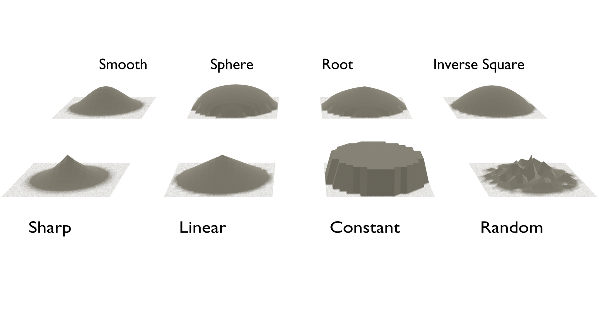

```{r setup, include=FALSE}
knitr::opts_chunk$set(echo = TRUE)
```

Blender bietet eine Reihe weiterer Funktionen, welche nützlich für die Erstellung von 3D-Objekten sein können. Einige dieser Hilfestellungen sind in mittig in der Menüleiste des 3D Viewports aufzufinden.

# Die Position des 3D Cursors verändern

<div class="marginnote"> 3D Cursor verschieben und rotieren </div>

Der 3D Cursor stellt für einige der Hilfsmittel eine wichtige Komponente dar. Deshalb ist es sinnvoll, sich damit zu befassen, wie der 3D-Cursor bewegt werden kann. In der Sidebar, welche mit der Taste N ein- und ausgeblendet werden kann, befindet sich unter dem Register «View» ein Abschnitt zum 3D-Cursor. An dieser Stelle kann die Position des Cursors im dreidimensionalen Raum anhand der drei Achsen definiert werden. Nebst der Position verfügt der 3D-Cursor über eine Rotation, welche an dieser Stelle ebenfalls definiert werden kann. Durch eine Veränderung der Rotation des 3D-Cursors verändert sich auch die Rotation der Linien, welche dem 3D-Cursor sein Fadenkreuz-Design geben. Diese Linien stellen daher die Rotation des 3D-Cursors dar.

<div class="marginnote"> Snap Menü </div>

Mittels der Tastenkombination ƒ + S lässt sich zudem das Snap-Menü öffnen. Dieses erscheint jeweils direkt beim Maus-Cursor und ermöglicht es, entweder die ausgewählten Objekte oder den 3D-Cursors an bestimmte Positionen zu verschieben. Das Menü beinhaltet folgende Optionen: 

*   **Cursor to Grid**: Dadurch wird der 3D Cursor an der nächsten liegenden Position des Koordinatengitters verschoben, welches als Viewport Overlay angezeigt wird. 
*   **Cursor to World Origin**: Dadurch wird der 3D Cursor an den Ursprung der Welt positioniert. Dies entspricht dem Nullpunkt aller drei Achsen.
*   **Cursor to Selected**: Der 3D Cursor wird an der Position des ausgewählten Objektes, respektive dem Median der aktuellen Auswahl, positioniert. 
*   **Cursor to Active**: Der 3D Cursor wird an der Position des aktiven Elementes positioniert. 
*   **Selection to Cursor (Keep Offset)**: Alle ausgewählten Elemente werden zum 3D Cursor verschoben, so dass der Median der Elemente der Position des 3D Cursors entspricht. Die Relationen zwischen den ausgewählten Objekten bleiben dabei bestehen. 
*   **Selection to Cursor**: Alle ausgewählten Elemente werden zum 3D Cursor verschoben, so dass die Position jedes individuellen Elementes der Position des 3D Cursors entspricht. Im Edit-Mode führt dies etwa dazu, dass alle ausgewählten Vertices auf der Position des 3D Cursors liegen. 
*   **Selection to Active**: Die Auswahl wird an die Position des aktiven Objektes verschoben. Im Edit-Mode führt dies etwa dazu, dass alle ausgewählten Vertices anschliessend auf derselben Position liegen.
*   **Selection to Grid**: Das ausgewählte Elemente oder der Median der ausgewählten Elemente wird an der nächsten liegenden Position des Koordinatengitters verschoben, welches als Viewport Overlay angezeigt wird. Im Edit-Mode führt dies etwa dazu, dass alle ausgewählten Vertices anschliessend auf derselben Position liegen.

# Transform Orientation

<div class="marginnote"> Verschieden Orientierungen für Transformationen </div>

Bei Transformationen können jeweils die X-, Y- und Z-Achsen zu Hilfe gezogen werden. Diese Achsen scheinen zunächst fix fest gelegt zu sein. Es ist allerdings möglich diese Achsen zu verschieben. Die Transform Orientation beschreibt die Verschiebung dieser Achsen. Es stehen folgende Orientierungen zur Verfügung:

*   Global
*   Local
*   Normal
*   Gimbal
*   View
*   Cursor

<div class="marginnote"> Gizmos helfen bei der Orientierung </div>

Um ein besseres Verständnis für die Unterschiede in den Transform Orientierungen zu bekommen ist es sinnvoll unter dem Dropdown-Menü für die Viewport Gizmos das Gizmo für die Bewegung einzuschalten. Dadurch erscheint ein Gizmo, welches jeweils vorgibt in welche Richtung sich die Achsen durch die Transform Orientierung erstrecken.

## Global

<div class="marginnote"> Globale Orientierung </div>

Die globale Orientierung entspricht immer genau den Achsen der Welt. Das heisst, man kann sich dabei immer an den vorgegebenen Achsen im Viewport Overlay orientieren.

## Local

<div class="marginnote"> Lokale Orientierung </div>

Die lokale Orientierung entspricht jeweils der Orientierung eines Objektes. Wenn ein Objekt etwa im Object-Mode um 20° rotiert wurde, sind auch die Achsen um diese 20° rotiert. Dies Einstellung gilt sowohl für den Object- als auch für den Edit-Mode.

## Normal

<div class="marginnote"> Orientierung entlang der Normalen </div>

Die Orientierung anhand der Normalen verläuft im Edit-Mode so, dass die Z-Achse immer entlang der Normalen der ausgewählten Einheiten entspricht. Die X- und Y-Achse beschreiben dann die Achsen im Verhältnis zu den Normalen. Wenn mehrere Elemente ausgewählt sind, entspricht die Z-Achse dem Mittelwert der Normalen. Im Object-Mode ist diese Orientierung äquivalent zur lokalen Orientierung.

## Gimbal

<div class="marginnote"> Gimbal Orientierung </div>

Die Gimbal-Orientierung stellt eine fortgeschrittene Orientierungsmethode dar, welche bei Euler-Rotationen von Nutzen sein können. Im Rahmen dieses Kurses werden Euler-Rotationen allerdings nicht behandelt, weshalb auch diese Orientierung nicht weiter behandelt wird. 

## View

<div class="marginnote"> Orientierung entlang der Ansicht </div>

Die View Orientierung entspricht der Orientierung entsprechend der Ansicht auf dem Bildschirm. Die X-Achse verläuft dabei horizontal über den Bildschirm und die Y-Achse vertikal. Die Z-Achse beschreibt die Achse der eigenen Ansicht nach näher oder weiter weg.

## Cursor

<div class="marginnote"> Orientierung entsprechend dem 3D Cursor </div>

Die 3D-Cursor Orientierung verläuft entlang des 3D-Cursors. Dabei wird die Rotation des Cursors berücksichtig, so dass die Achsen entsprechend der 3D-Cursor-Rotierung verlaufen.

## Custom

<div class="marginnote"> Eigene Orientierung hinzufügen </div>

Es ist zudem möglich eigene Orientierungen zu erstellen mittels dem Plus-Button. So kann beispielsweise die lokale Orientierung eines Objekts abgespeichert werden um sie bei anderen Objekten, die eigentlich eine andere lokale Orientierung aufweisen, ebenfalls benutzen zu können.

# Pivot Point

<div class="marginnote"> Verschiedene Drehpunkte </div>

Eine Reihe von Transformationen orientieren sich an einem bestimmten Drehpunkt im dreidimensionalen Raum. Wenn vom Standard-Würfel etwa nacheinander zwei gegenüberliegende Faces ausgewählt werden, orientiert sich eine Skalierung der Faces anhand der Medianposition der Vertice. Mittels dem Menüreiter «Transform Pivot Point» können allerdings auch andere Drehpunkte ausgewählt werden. Die Optionen sind dabei:

*   Bounding Box Center
*   3D Cursor
*   Individual Origins
*   Median Point
*   Active Element

## Bounding Box Center

<div class="marginnote"> Bounding Box Center als Drehpunkt </div>

Die Option “Bounding Box Center” berechnet jeweils eine dreidimensionale Box um die ausgewählten Einheiten herum, welche gerade so gross ist, dass sich die gesamte Auswahl darin befindet. Der Mittelpunkt dieser Box wird anschliessend als Drehpunkt für Transformationen verwendet. Im Object-Mode werden lediglich die Ursprünge von Objekten für die Berechnung der Box verwendet, nicht die Meshes. Im Edit-Mode wird die Box hingegen um alle ausgewählten Einheiten berechnet.

## 3D Cursor

<div class="marginnote"> 3D Cursor als Drehpunkt </div>

Die Option “3D Cursor” verwendet die Position des 3D-Cursors als Drehpunkt für Transformationen. Die Position des 3D-Cursors kann auch in seiner Position verändert werden. Dadurch lässt sich jede beliebige Stelle im dreidimensionalen Raum als Drehpunkt verwenden.

## Individual Origins

<div class="marginnote"> Individual Origin als Drehpunkt </div>

Die Option “individual Origins” benutzt für jede ausgewählte Einheit den entsprechenden Ursprung als Drehpunkt. Wenn im Object-Mode mehrere Objekte ausgewählt sind, deren Ursprünge sich an verschiedenen Positionen befinden, verwendet jedes Objekt seinen individuellen Ursprung als Drehpunkt. Im Edit-Mode werden dabei Einheiten, die nicht direkt miteinander verbunden sind als individuelle Einheiten betrachtet. Diese verwenden dann ihren individuellen Median als Drehpunkt für Transformationen. Werden vom Default-Cube beispielsweise zwei gegenüberliegende Faces ausgewählt, wird von jedem Face individuell der Median berechnet und dieser für das jeweilige Face als Drehpunkt verwendet. Wenn mehrere Faces, die direkt nebeneinander liegen ausgewählt sind, werden die aneinanderlegenden Faces zusammengefasst und für diese gemeinsam ein individueller Ursprung berechnet und als Drehpunkt verwendet.

## Median Point

<div class="marginnote"> Median als Drehpunkt </div>

Die Option «Median Point» wird bei neuen Projekten als Default-Auswahl für den Drehpunkt von Transformationen verwendet. Dabei handelt es sich um die mittlere Position zwischen allen ausgewählten Vertices im Edit-Mode. Wenn mehrere Objekte im Object-Mode ausgewählt sind, wird der Median zwischen den Objekt-Ursprungspositionen als Drehpunkt verwendet.

## Active Element

<div class="marginnote"> Ursprung des aktiven Elements als Drehpunkt </div>

Die Option «Active Element» verwendet jeweils den Ursprung des aktiven Elements als Drehpunkt für Transformationen. Beim aktiven Element handelt es sich um das zuletzt ausgewählte Objekt, welches jeweils mit einer orangen Umrandung gekennzeichnet ist. Der Ursprungspunkt dieses Objekts wird anschliessend als Drehpunkt für Transformationen verwendet. Im Edit-Mode ist das aktive Element jeweils mit einer weissen Einfärbung markiert. Dieses Element, respektive der Median dieses Elements bei Faces oder Edges, wird anschliessend als Drehpunkt für Transformationen verwendet.

# Snap
<div class="marginnote"> Elemente an anderen Elementen andocken lassen </div>

Die Option Snap ist bei der Verschiebung von Objekten nützlich. Dabei können andere Elemente benutzt werden, um die zu verschiebenden Objekte direkt an deren Struktur andocken zu lassen. So müssen nicht die etwaigen Koordinaten ermittelt werden, sondern Blender rastet die zu bewegenden Objekte direkt an dieser Auswahl ein. Die anvisierten Strukturen können dabei im Edit-Mode Teil des eigenen Objekts sein, aber auch Teil eines anderen Objektes. Im Object-Mode wird zudem jeweils der Ursprung des Objektes zum Andocken verwendet. Im Drop-Down-Menü kann eingestellt werden, an welchen Stellen jeweils angedockt werden soll:

<div class="marginnote"> Verschiedene Andock-Stellen </div>

*   Increment
*   Vertex
*   Edge
*   Face
*   Volume
*   Edge Center
*   Edge Perpendicular

## Increment

<div class="marginnote"> Snap auf ein Inkrement </div>

Ist Snap auf die Inkremente aktiviert, so werden die Inkremente der Welt verwendet, um Objekte anders zu platzieren. Mit diesen Inkrementen sind die Gitter Raster im Hintergrund der 3D-Ansicht gemeint. Jedes Viereck stellt dabei ein Inkrement dar. Durch stärkeres hinein- oder hinaus-zoomen werden jeweils grössere oder kleinere Inkremente sichtbar. Die ausgewählten Objekte rasten jeweils an derselben proportionalen Stelle in einem Inkrement ein.

## Vertex

<div class="marginnote"> Snap auf Vertices </div>

Ist Snap auf Vertex eingestellt, so können jeweils andere Vertices angesteuert werden und Blender verbindet die Auswahl direkt auf die entsprechende Position. Dabei können auch die Vertices von anderen Objekten angesteuert werden, selbst wenn diese nicht innerhalb des Edit-Mode mit aktiviert wurden.

## Edge

<div class="marginnote"> Snap auf Edges </div>

Ist Snap auf Edge eingestellt, so 	können andere Edges als Ziel angesteuert werden und die Auswahl wird direkt passend auf eine Position auf dem Edge eingestellt. Dabei kann die ganze Länge eines Edges ausgewählt werden. Es können zudem auch Edges von anderen Objekten angesteuert werden, selbst wenn diese nicht innerhalb des Edit-Mode mit aktiviert wurden.

## Face

<div class="marginnote"> Snap auf Faces </div>

Ist Snap auf Faces eingestellt, so versucht Blender die Auswahl direkt an der Position von anderen Faces anzudocken. Dabei kann jeder Punkt auf einem Face ausgewählt werden. Zudem können auch hier die Faces von anderen Objekten angesteuert werden.

## Volume

<div class="marginnote"> Snap auf das Volumen </div>

Mittels der Einstellung von Snap auf Volume lässt sich das Volumen eines Objektes als genaues Ziel zum Einrasten einer Auswahl verwenden. Oftmals ist nicht so einfach ersichtlich, wo genau das Objekt nun einrastet, da das Volumen eines Objektes häufig durch die Faces verdeckt sind. Hierbei kann die Wireframe-Ansicht etwas helfen, jedoch ist dabei die Position auf einer Achse nicht ganz ersichtlich. Auf dieser Achse wird in der Regel die Mitte des Volumens anvisiert.

## Edge Center

<div class="marginnote"> Snap auf die Mitte von Edges </div>

Mittels der Einstellung von Snap auf Edge Center werden jeweils die Mittelpunkte von Edges anvisiert. Hierbei werden also keine Vertices anvisiert, sondern der Median des Edges. Andere Punkte auf dem Edge werden nicht zum Einhaken angeboten.

## Edge Perpendicular

<div class="marginnote"> Snap auf senkrechte Edges </div>

Mittels der Einstellung von Snap auf Edge Perpencidular wird die Auswahl bei dem Punkt eines Edges eingerastet, welcher im Lot zur aktuellen Auswahl steht. Dabei können allerdings nicht alle Edges verwendet werden da nicht alle einen solchen Winkel zur Auswahl ermöglichen.

## Was wird eingehackt?

<div class="marginnote"> Quelle des Snaps einstellen </div>

Wenn lediglich ein einzelner Vertex ausgewählt und verschoben wird, ist klar, welcher Punkt jeweils an den anvisierten Stellen einzuhacken hat: der ausgewählte Vertex. Wenn allerdings mehrere Elemente ausgewählt wurden, benutzt Blender per Default das jeweils am ursprünglich am nächsten liegenden Element zum Einrasten. Es ist allerdings auch möglich einzustellen, dass der Median der aktivierten Auswahl verwendet wird, oder das aktive Element. Hierzu kann die entsprechende Auswahl unter «Snap With» eingestellt werden. Zusätzlich gibt es hier noch die Auswahl «Center», welche zusätzlich noch weitere Abweichungen vom Drehpunkt mitberücksichtigt (beispielsweise die Ursprüngliche Abweichung vom 3D Cursor).

# Proportional Editing

<div class="marginnote"> Proportionale Bearbeitung mittels O aktivieren </div>

Die Option «Propotional Editing» ermöglicht es, dass nahe beieinander liegende Elemente proportional zu ihrer Nähe bearbeitet werden können. Diese Option kann zudem mit der Taste O aktiviert werden. Wenn diese Option aktiviert ist und eine Transformation durchgeführt wird (z.B. eine Rotation), erscheint um den Bezugspunkt ein Kreis. Alle Elemente, welche sich innerhalb dieses Kreises befinden, werden diese Transformation nun ebenfalls durchführen. Der Radius des Kreises kann mittels dem Mausrad vergrössert oder verkleinert werden. Dadurch wird der Erfassungsbereichs der proportionalen Bearbeitung variiert. Alternativ kann die Taste ¢ zum Vergrössern des Kreises oder « zum Verkleinern des Kreises gedrückt werden.

<div class="marginnote"> Proportionale Bearbeitung im Object-Mode </div>

Im Object-Mode müssen sich jeweils die Ursprünge der Objekte, welche proportional mit transformiert werden sollen, innerhalb des Erfassungskreises liegen. Dabei spielt es keine Rolle, ob das Mesh des Objektes ebenfalls erfasst wird oder nicht. Im Edit-Mode können lediglich die Vertices der aktuell bearbeiteten Objekte proportional mit transformiert werden. Zudem gibt es im Edit-Mode noch die Möglichkeit im Sub-Menü des Proportional Editings die Option «Connected Only» anzuwählen. Dadurch werden lediglich Vertices mit bearbeitet, die über Edges mit den zu bearbeitenden Vertices verbunden sind.

<div class="marginnote"> Form der proportionalen Bearbeitung </div>

Die Elemente, welche sich innerhalb des Erfassungskreises befinden, werden anschliessend alle proportional mit transformiert. Die Proportion erfolgt dabei einer vorgegebenen Kurve. Diese lässt sich anhand des Sub-Menüs genauer definieren. Dadurch lassen sich mit der Bearbeitung eines einzigen Vertex gleich komplexe Strukturen erstellen.
 

 
<div class="marginnote"> Anwendungs-Bereiche für proportionale Bearbeitung </div>

Gerade natürliche Objekte (Früchte, Landschaften, Bäume, Blumen, usw.) sind selten schön symmetrisch. Oftmals gibt es Dellen oder andere Verformungen. Mittels dem Proportional Editing können solche Verformungen leicht auf grössere Flächen angewendet werden, ohne dass jeder Vertex einzeln bearbeitet werden muss.

::: {.exercise  data-latex="{exercise}"}

# Übung 8:  Proportional Editing

## Übung 8.1 

Erstellen sie eine UV Sphere und versuchen Sie daraus eine Birne zu modellieren. Nutzen Sie hierfür proportional Editing.

:::

# Optionen

<div class="marginnote"> Symmetrische Bearbeitung </div>

Im Edit Mode sind in der oberen rechten Ecke zudem noch weitere Optionen verfügbar. Zum einen sind die drei Achsen X, Y und Z als Symbol anwählbar. Durch das Anwählen einer dieser Icons wird das Objekt entsprechend der ausgewählten Achse symmetrisch bearbeitet. Eine Veränderung des Objekts auf der einen Seite der Achse wird dabei also gleichzeitig auch auf der gegenüberliegenden Achse durchgeführt. Gerade bei symmetrischen Objekten hat dies den Vorteil, dass der Fokus nur auf eine Seite gelegt werden muss, ohne dass di Bearbeitungen auf der anderen Seite nochmals wiederholt werden müssen.

<div class="marginnote"> Vertices automatisch verbinden </div>

Neben den drei Achsen befindet sich zudem das Icon für die Option «Auto Merge». Durch das Aktivieren dieser Option werden Vertice, welche während der weiteren Bearbeitung auf derselben Position platziert werden, automatisch miteinander. Dadurch ist es nicht mehr nötig von Hand Vertices zusammenzufassen.