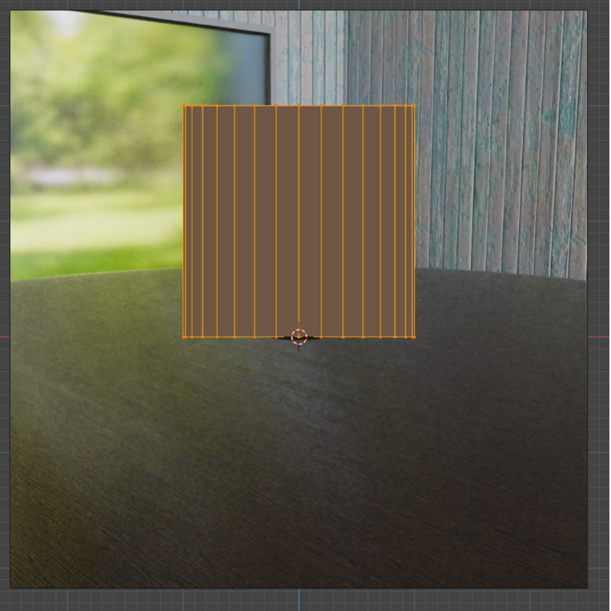

```{r setup, include=FALSE}
knitr::opts_chunk$set(echo = TRUE)
```

<div class="marginnote"> Ziel dieses Tutorials </div>

Bislang wurden die grundlegenden Prinzipien der Objektbearbeitung behandelt. Dieser ermöglichen bereits eine Vielzahl von Bearbeitungsmöglichkeiten, so dass schon sehr komplexe Objekte modelliert werden können. Nachfolgend daher eine Erklärung, wie beispielsweise die erläuterten Bearbeitungsmöglichkeiten verwendet werden können, um ein Glas zu modellieren, wie beispielsweise in Abbildung 24. 

<div style= "float:right;position: relative; padding: 1%; width: 60%; font-size:60%;">

</div>

<div class="marginnote"> Würfel löschen </div>

Zunächst wird ein neues Blender-Projekt geöffnet. Da das Glas eine runde Form hat, ist der Standardwürfel nicht geeignet, um das Glas nachzubilden. Aus diesem Grund wird er mittels der Taste <kbd>X</kbd> gelöscht. 

<div class="marginnote"> Referenzbild einfügen </div>

Generell ist es empfehlenswert bei der Erstellung von Objekten mit Referenzbildern zu arbeiten. Aus diesem Grund benötigen wir eine Bildvorlage für das Glas. Hierfür kann eine Bilddatei direkt aus dem Browser in den 3D Viewport hinein bewegt werden, so dass das Bild anschliessend direkt in der Szene sichtbar wird. Das Bild wird allerdings so eingefügt, dass es senkrecht zur eigenen Ansicht sichtbar ist. Das bedeutet, dass das Bild entsprechend der eigenen Ansicht rotiert wird. Aus diesem Grund empfiehlt es sich vor dem Hineinziehen des Bildes in die Frontansicht zu wechseln. Dadurch wird das Bild lediglich entlang der X-Achse um 90° rotiert eingefügt. Alternativ kann das Bild über das «Add»-Menü (<kbd>Shift</kbd> + <kbd>A</kbd>) unter «*Image | Reference*» hinzugefügt werden. Zudem ist das Bild jeweils nur sichtbar, wenn die Viewport Overlays sichtbar sind. 

<div class="marginnote"> Bild platzieren </div>

Allenfalls sollte das Referenzbild noch etwas im Raum platziert werden. Idealerweise wird das Bild so platziert, dass sich der Mittelpunkt des unteren Endes des Glases am Nullpunkt der Welt befindet. An dieser Stelle sollte sich ebenfalls der 3D-Cursor befinden. 

<div class="marginnote"> Primitive Mesh erstellen </div>

Als nächstes wird nun das Objekt hinzugefügt, aus dem anschliessend das Glas geformt werden soll. Dieses hat im Idealfall bereits eine ähnliche Form, wie das zu erstellende Projekt. In diesem Falle würde dies einem Zylinder entsprechen. Über das Add-Menü (<kbd>Shift</kbd> + <kbd>A</kbd>) wird unter «*Mesh | Cylinder*» ein Zylinder an der Position des 3D-Cursors erstellt. Der Zylinder kann dabei in seinen Default-Einstellungen so belassen werden.

<div class="marginnote"> Zylinder positionieren </div>

Mittels der Taste <kbd>Tab</kbd> wird in den Edit-Mode gewechselt, um die Bearbeitung des Zylinders zu starten. 
Die Höhe des Zylinders erstreckt sich nun von Z=-1m bis Z=1m. Somit lieg ein Teil des Zylinders unterhalb des Ursprungs des Objektes. Deshalb wird der Zylinder nun um einen Meter entlang der Z-Achse verschoben. Mittels der Taste <kbd>A</kbd> werden alle Elemente des Zylinders ausgewählt. Um nun eine Verschiebung entlang der Z-Achse um einen Meter zu bewirken, wird die Taste <kbd>G</kbd> zum Starten der Bewegung, die Taste <kbd>Z</kbd> zum Einrasten entlang der Z-Achse, die Zahl <kbd>1</kbd> zur Angabe der Bewegung um einen Meter und die Taste <kbd>Enter</kbd> zum Bestätigen gedrückt. Nun sollte der Boden des Zylinders am Nullpunkt liegen, so wie in Abbildung 25.

<div style= "float:right;position: relative; padding: 1%; width: 50%; font-size:60%;">

</div>

<div class="marginnote"> Höhe des Zylinder-Deckels anpassen </div>

Der Zylinder ist nun zwar an der Position des Glases, allerdings weist er noch die falschen Dimensionen auf. Wenn der Zylinder nun skaliert würde, sich auch der gerade angepasste Boden verschieben. Deshalb werden die Vertices des Deckels manuell ausgewählt und verschoben. Hierfür wird bei gedrückter Taste <kbd>Alt</kbd> ein Edge entlang des Zylinder-Deckels ausgewählt. Dadurch werden alle Vertices entlang der Schlaufe dieses Edges ausgewählt – also in dem Falle alle Vertices auf dem Deckel des Zylinders. Diese Vertices werden nun entlang der Z-Achse um den Wert -1.2 verschoben, so dass sie die Höhe Z=0.8 aufweisen.
Als nächstes wird der Mantel des Zylinders angepasst, so dass er der maximalen Breite des Glases entspricht. Es werden also alle Vertices ausgewählt und entlang der X- und Z-Achse kleiner skaliert. Hierfür werden zunächst alle Vertices des Objektes mittels der Taste <kbd>A</kbd> ausgewählt. Anschliessend wird mittels der Taste <kbd>S</kbd> der Skalierungsvorgang gestartet, und mittels der Tastenkombination <kbd>Shift</kbd> + <kbd>Z</kbd> die Z-Achse ignoriert. Durch die Eingabe von <kbd>0</kbd> <kbd>.</kbd> <kbd>6</kbd> und der Bestätigung mittels <kbd>Enter</kbd>wird anschliessend das Objekt entlang der X- und Y-Achse um den Faktor 0.6 skaliert.

<div class="marginnote"> Zylindermantel in Edges unterteilen </div>

In den nächsten Bearbeitungsschritten muss der Mantel des Zylinders entsprechend der Form angepasst werden. Hierfür werden allerdings weitere Vertices Innerhalb des Zylindermantels benötigt. Um diese hinzuzufügen, werden mittels eines Loop-Cuts 10 Edges entlang des Zylindermantels eingefügt. Hierfür wird mittels der Tastenkombination <kbd>Cmd</kbd> + <kbd>R</kbd> zunächst der Loop-Cut Modus gestartet. Anschliessend wird der Mauszeiger über die Edges, welche vertikal dem Zylindermantel entlang verlaufen, bewegt. Dadurch sollte Blender nun einen Schnitt entlang des Zylindermantels in der Mitte der Höhe vorschlagen. Um statt einem Schnitt gleich 10 Schnitte zu erhalten, wird die Zahl <kbd>1</kbd><kbd>0</kbd> eingegeben und der Schnitt anschliessen mittels der linken Maustaste oder <kbd>Enter</kbd> bestätigt. Anschliessend muss nochmals mittels der linken Maustaste oder <kbd>Enter</kbd> bestätigt werden, dass der Loop-Cut mittig der Flächen verlaufen soll.

<div class="marginnote"> Anpassen der Breite von Hand </div>

Die neu erstellten Edges werden nun horizontal der Breite des Glases auf der jeweiligen Höhe angepasst. Dies kann zum einen manuell von Hand für jede Reihe an Edges erfolgen. Hierfür wird mittels <kbd>Alt</kbd> und der linken Maustaste auf ein horizontales Edge die gesamte Reihe von Edges ausgewählt. Mittels der Skalierung (<kbd>S</kbd>) entlang der X- und Z-Achse (<kbd>Shift</kbd> + <kbd>Z</kbd>) kann anschliessend der Radius für die entsprechende Höhe eingestellt werden. Dies wird anschliessend nacheinander für jede Edge-Reihe erstellt.

<div class="marginnote"> Anpassen der Breite mittels proportional Editing </div>

Alternativ kann auch auf das Proportional Editing zurückgegriffen werden, welches mittels der Taste <kbd>O</kbd> aktiviert wird. Nun kann etwa die oberste Reihe von Edges mittels <kbd>Alt</kbd> und der linken Maustaste auf ein horizontales Edge entlang des oberen Randes des Zylinders ausgewählt werden. Anschliessend wird mittels der Taste <kbd>S</kbd> die Skalierung gestartet. Für das proportionale Editing wird nun ein Kreis dargestellt. Dieser kann mittels dem Mausrad verkleinert oder vergrössert werden. Sein Radius ist im oberen Bildschirmrand angezeigt und sollte wohl rund .75 betragen. Anschliessend kann die Skalierung entlang der X- und Z-Achse festgelegt werden (<kbd>Shift</kbd> + <kbd>Z</kbd>) und um den Faktor 0.85 skaliert werden. Dieser Vorgang wird anschliessend nochmals am unteren Rand des Zylinders wiederholt (mit einem Radius von ca. 0.5 und einer Skalierung um den Faktor 0.5). Anschliessend wird bei deaktiviertem Propotional-Editing noch der Untere Rand erneut um den Faktor 0.9 entlang der X- und Y- Achse skaliert, und der obere Rand ebenfalls um den Faktor 0.975.

<div class="marginnote"> Zylinder-Deckel löschen </div>

Der Zylinder sollte nun bereits die Form des Glases aufweisen. Durch einen Wechsel in den Face-Select-Modus ist es möglich anschliessend direkt das Face, welches den Deckel des Zylinders darstellt, auszuwählen und mittels <kbd>X</kbd> zu löschen. Anschliessend ist das Glas so gut wie fertig – es fehlt im lediglich noch eine Dicke.

<div class="marginnote"> 3D Cursor verschieben </div>

Um die Dicke des Glases zu erstellen, sollen alle Faces gegen den Mittelpunkt des oberen Randes des Zylinders hinausgezogen werden. Hierfür muss zunächst der 3D-Cursor mittig des oberen Randes platziert werden. Dies geschieht, indem alle Edges entlang dem oberen Rand ausgewählt werden (hierfür muss wieder in den Edge- oder Vertex-Select-Modus gewechselt werden). Anschliessend wird mittels der Tastenkombination <kbd>Shift</kbd> + <kbd>S</kbd> das Snap-Menü geöffnet. Hier wird anschliessend «Cursor to Selected» ausgewählt, um den Cursor mittig in der Auswahl zu platzieren.

<div class="marginnote"> Fläche nach innen extrudieren </div>

Anschliessend wird der Bezugspunkt für Transformationen auf den 3D-Cursor gewechselt (unter dem Button «Transform Pivot Point» im Header). Nachdem alle Elemente des Zylinders mittels <kbd>A</kbd> ausgewählt wurden, können nun alle Flächen mittels der Taste <kbd>E</kbd> extrudiert werden. Mittels der Taste <kbd>S</kbd> wird skalierend extrudiert und mittels der Taste <kbd>0</kbd><kbd>.</kbd><kbd>9</kbd><kbd>5</kbd> der Faktor 0.95 festgelegt. Dies kann schliessend mittels linken Maustaste oder <kbd>Enter</kbd> bestätigt werden. Mit diesem Schritt ist das Glas bereits fertiggestellt. Es sieht noch etwas eckig und kantig aus, aber in den nächsten Kapiteln wird behandelt, wie das Glas noch glatter erscheint.

<div class="marginnote"> Back-Up-Objekt erstellen </div>

Es gibt noch eine andere Methode zur Erstellung des Glases. Zur Veranschaulichung dieser Methode kann im Object-Mode nach der Auswahl des Glases mittels der Taste <kbd>D</kbd> ein Duplikat erstellt werden, welches mit der Taste <kbd>H</kbd> versteckt werden kann. Dadurch bleibt dieses Duplikat erhalten, so dass trotzdem die andere Methode ausprobiert werden kann. 

<div class="marginnote"> Querschnitt des Glases erstellen </div>

Nun wird das andere Glas im Edit-Mode bearbeitet. Das Ziel ist es hierbei, dass ein Querschnitt des Glases entsteht. Diese Methode erfordert den Vertex-Select-Mode. Mittels <kbd>Alt</kbd> und der linken Maustaste wird ein Edge, welches vertikal dem Glas entlang verläuft ausgewählt und mittels der Tastenkombination <kbd>Cmd</kbd> + <kbd>I</kbd> die Auswahl umgekehrt. Nun werden alle anderen Vertices mittels <kbd>X</kbd> gelöscht. Dadurch sollten nun lediglich die Vertices übrigbleiben, die den Rand eines Glases vertikal darstellen. Die äussersten Vertices werden anschliessend extrudiert und auf ihrer jeweiligen Höhe am Nullpunkt der Szene platziert.

<div class="marginnote"> Kreisförmiges Herausziehen mittels dem Spin-Tool </div>

Anhand eines solchen Querschnittes eines Glases kann nun mittels dem Spin-Tool kreisförmig die Form des Glases extrudiert werden. Hierfür wird zunächst in der Toolbar das Spin-Tool aktiviert. Anschliessend werden alle Vertices mit der Taste <kbd>A</kbd> ausgewählt. Durch das Ziehen entlang eines der beiden «+»-Symbole entlang des Spin-Gizmos kann anschliessend das Glas kreisförmig aus dem Querschnitt herausgezogen werden. Im Kontext-Menü zur letzten Aktion kann anschliessend der Radius noch auf 360° festgelegt werden und darunter «Auto Merge» aktiviert werden. Dadurch werden die beiden Enden des extrudierten Bereichs zusammen verbunden. Zusätzlich kann unter «Steps» noch die Anzahl extrudierter Faces erhöht werden, um einen glatteren Kreis zu erhalten. 

::: {.exercise  data-latex="{exercise}"}
#   Übung 9:  Eigenes Glas erstellen
## Übung 9.1 

Nehmen Sie ein rundes Glas aus Ihrem eigenen Haushalt, welches Sie anschliessend in Blender nachbauen. Idealerweise nehmen Sie ein Glas ohne weitere Oberflächenstrukturen drauf. 
Machen Sie ein Foto von diesem Glas von der Seite in einem möglichst rechten Winkel und verwenden Sie dieses Fot anschliessend als Vorlage in einem Blender-Projekt. Bauen Sie dieses Glas anschliessend selbst als 3D-Objekt nach.
Speichern Sie das Glas zudem ab, um es in späteren Kapiteln verwenden zu können. 

:::