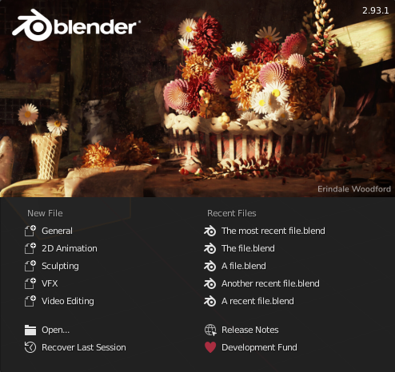
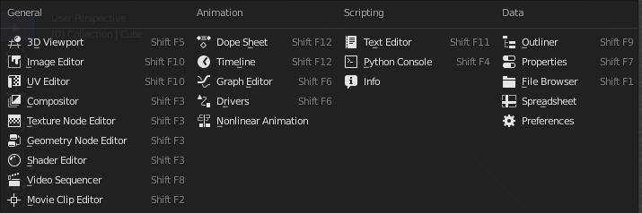
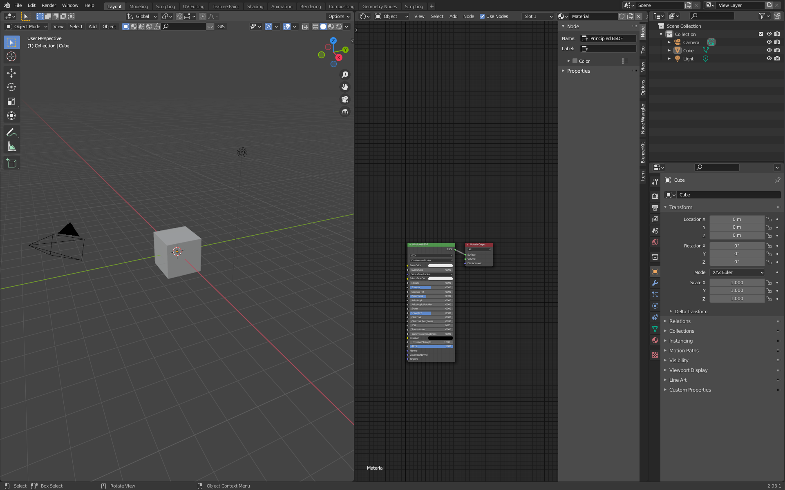
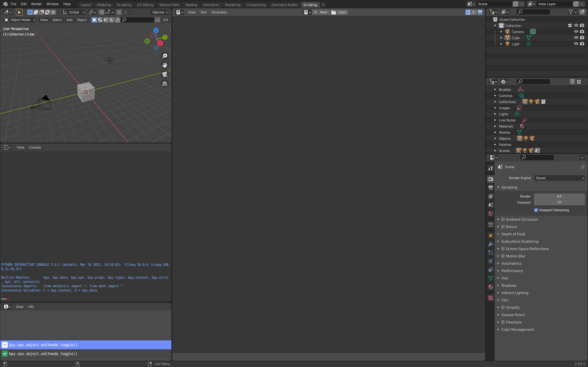

```{r setup, include=FALSE}
knitr::opts_chunk$set(echo = TRUE)
```


# Das Willkommen-Fester

<div class="marginnote"> Optionen im Willkommens-fenster </div>

Blender begrüsst seine Nutzer mit einem Willkommen-Fenster. In diesem Fenster werden die letzten geöffneten Projekte auf der rechten Seite unter den «*Recent Files*» aufgelistet. Auf der linken Seite des Willkommen-Fenster kann unter «*New File*» ein neues Projekt erstellt werden. Dabei lässt sich die Art des Projekts bereits genauer definieren. Je nach ausgewählter Projekt-Art werden unterschiedliche Ansichts-Vorlagen geladen.



<div class="marginnote"> Auswahl von Ansichtsvorlagen </div>

Zu den möglichen Ansichts-Vorlagen gehören:

*   **General**: Öffnet eine Standardvorlage für das Bearbeiten von 3D-Objekten.
*   **2D Animation**: öffnet eine Vorlage zum Erstellen von 2D-Animationen.
*   **Sculpting**: Öffnet eine Vorlage, welche für das Sculpting von Objekten geeignet ist. Dabei werden Objekte anhand von Bürsten direkt in ihrer Form verändert.
*   **VFX**: Öffnet eine Vorlage für die Erstellung visueller Effekte (VFX), beispielsweise in Videos.
*   **Video Editing**: Öffnet eine Vorlage zum Bearbeiten von Videos.

<div class="marginnote"> Fokus auf «General» </div>

Dieser Kurs wird sich auf die 3D-Modellierung fokussieren. Deshalb wird jeweils die Ansichts-Vorlage «*General*» verwendet. Diese Vorlage ist so generell, dass sie im Hintergrund sogar schon geladen ist, während das Willkommens-Fenster dargestellt wird. Deshalb ist es auch möglich einfach ausserhalb des Willkommens-Fensters zu klicken. Dadurch verschwindet das Willkommen-Fenster und die General-Vorlage, die bereits im Hintergrund besteht, wird sichtbar.


#Die verschiedenen Panels beim General-Projekt

<div class="marginnote"> Default Editore </div>

Die verschiedenen Werkzeuge, welche Blender anbietet, sind innerhalb verschiedener Editore aufzufinden. Diese Editore werden als separate und austauschbare Panel-Areale in Blender dargestellt. Beim Start eines neuen Projekts (mit der Vorlage General) ist die Ansicht in vier Areale unterteilt:

*   **3D Viewport**: überspannt von der oberen linken Ecke den grössten Teil des Bildschirms.
*   **Outliner**: Befindet sich in der oberen, rechten Ecke.
*   **Properties**: Befindet sich in der unteren, rechten Ecke.
*   **Timeline**: Befindet sich links, am unteren Rand.
Gerade der 3D Viewport, der Outliner und die Properties sind für das Erstellen von 3D Objekten mit Blender von hoher Bedeutung. Die Timeline wird bei Animationen verwendet.


 
# Übersicht über die Editor-Fenster von Blender

<div class="marginnote"> Editore austauschen </div>

In jedem Editor-Areal befindet sich in der linken oberen Ecke ein Knopf. Durch das Drücken dieses Knopfes wird ein Drop-Down-Menü geöffnet. Darin sind alle verfügbaren Editore aufgelistet. Durch das Auswählen eines Editors wird der Editor in dem entsprechenden Areal durch den ausgewählten Editor ersetzt.



<div class="marginnote"> General Editore </div>

## 3D Viewport
Der 3D Viewport stellt die bearbeiteten Szenen und die dazugehörigen 3D-Objekte dar. Er bietet die Möglichkeit zur direkten Interaktion mit diesen Objekten und ist für das Modellieren von Objekten essenziell. Bei der Arbeit mit 3D-Objekten ist es der wichtigste Editor.

## Image Editor
Anhand des Image Editors können 2D-Grafiken betrachtet und bearbeitet werden. Gerenderte Bilder werden ebenfalls in diesem Editor angezeigt.

## UV Editor
Der UV Editor wird verwendet, um den Flächen von Objekten eine bestimmte Position auf einer Textur (sogenannte UVs) zuzuweisen oder dessen Zuweisung zu betrachten.

## Compositor
Mithilfe des Compositors lassen sich Bilder, welche beim Rendern erstellt werden, nachträglichen Bearbeitungen unterziehen. Auch externe Bilder können hier bearbeitet werden. Die Bearbeitung erfolgt hier mittels einer visuellen Programmiersprache.

## Texture Node Editor
Mithilfe des Texture Node Editors können Texturen anhand einer visuellen Programmiersprache erstellt werden. Dieser Editor wird allerdings in Zukunft durch andere Bearbeitungsoptionen ersetzt.

## Geometry Node Editor
Der Geometry Node Editor ermöglicht das Bearbeiten von Objekten mittels einer visuellen Programmiersprache. Innerhalb dieses Editors erfolgt dabei die Programmierung die Bearbeitung der geometrischen Figuren, während die Darstellung der Figuren im 3D Viewport erfolgt. Bei den Geometry Nodes handelt es sich um eine neue Funktion von Blender.

## Shader Editor
Mithilfe des Shader-Editors können die Materialien, welche einem dreidimensionalen Objekt zugewiesen sind, bearbeitet werden. Dadurch lässt sich bearbeiten, wie die Oberfläche eines Objektes aussieht. Die Bearbeitung erfolgt hier mittels einer visuellen Programmiersprache. Innerhalb dieses Editors werden lediglich die Einstellungen für die Materialien gemacht. Um die Auswirkungen der Materialien zu sehen, wird der 3D Viewport verwendet.

## Video Sequencer
Mithilfe des Video Sequencer können Videoaufnahmen bearbeitet werden. Dieser Editor verfügt zusätzlich über eine Vorschau-Option, mit der sich die Videos direkt betrachten lassen.

<div class="marginnote"> Editore für Animationen </div>

## Movie Clip Editor
Der Movie Clip Editor ermöglicht das Erfassen von Bewegungen in Filmen, so dass diese Bewegungen beispielsweise auch auf 3D-Objekte angewendet werden können. Zudem lassen sich hier auch Videos maskieren.

## Dope Sheet
Das Dope Sheet stellt einzelne Animationspunkte eines Projektes in einem zeitlichen Ablauf tabellarisch dar. Dies basiert auf der früher angewendeten Planung von handgezeichneten Animationen.

## Timeline
Die Timeline stellt einen zeitlichen Verlauf von Animationen dar. Für die ausgewählten Objekte wird hier durch Punkte dargestellt, wann eine Animation im Zeitstrang starten oder enden soll. Zudem findet sich hier auch ein Menü-Knopf, um Animationen abspielen zu lassen.

## Graph Editor
Mittels des Graph Editors können Animationen über die Zeit hinweg verfeinert werden. Hierfür werden die einzelnen Animationen mittels Grafen dargestellt. Durch eine Veränderung dieser Grafen kann anschliessend die Animation verfeinert werden.

## Drivers
Der Driver Editor ermöglicht es, Animationen gezielt zu steuern. Dabei können die Eigenschaften eines Objektes verwendet werden, um ein anderes Objekt zu steuern.

## Nonlinear Animation
Mittels des Editors für nonlineare Animationen können Animationen ausserhalb eines linearen Ablaufes gesteuert werden. Dies kommt etwa bei komplexeren Veränderungen von Szenen zum Einsatz.


<div class="marginnote"> Editore für Programmier-Skripte </div>

## Text Editor
Im Text-Editor können Text-Dokumente eingesehen und erstellt werden. Diese Textdokumente können auch verwendet werden, um mittels der Programmiersprache Python Funktionen für Blender zu verfassen. Zudem können im Text-Editor auch direkt Programmfunktionen in Textdokumenten ausgeführt werden.

## Python Console
Anhand der Python-Konsole lassen sich Codes in der Programmiersprache von Python eingeben. Blender führt diese Codes anschliessend aus.

## Info
Im Info-Editor werden durchgeführte Aktionen in der Python-Programmiersprache nacheinander aufgelistet. Hier lassen sich auch Fehlermeldungen und Warnungen nachträglich einsehen.

<div class="marginnote"> Data Editore </div>

## Outliner
Im Outliner werden alle Daten, welche sich in einer Blender-Datei befinden, aufgelistet. Hier lassen sich Objekte innerhalb einer Szene auswählen oder in Ordnerstrukturen (sogenannte Collections) anordnen und gruppieren.

## Porperties
Im Properties-Panel lassen sich eine Reihe von Einstellungen machen. Dies umfasst neben Einstellungen zu einem aktuell ausgewählten Objekt auch Einstellungen zum Rendern, zur Szenengestaltung oder zu physikalischen Simulationen.

## File Browser
Mithilfe des File-Browsers lassen sich Dateien auf dem Computer darstellen und suchen. Dadurch können Dokumente direkt in die Szene hineingezogen werden, ohne dass Blender minimiert werden muss. Zudem können hier auch Dateien abgespeichert werden.

## Spreadsheet
Mithilfe des Spreadsheet lassen sich alle Datenpunkte eines Objektes mitsamt deren Position in der 3D Welt angeben. Nebst den punkten können auch die Positionen der verschiedenen Kanten und Flächen von Objekten angezeigt werden.

## Preferences
Unter den Preferences lassen sich die Einstellungen von Blender bearbeiten. Die Preferences können auch unter «Edit | Preferences» geöffnet werden.

#Vorgefertigte Editor-Anordnungen
Schnelle Auswahl von Editoren mittels Editor-Anordnungen
In der Menü-Leiste sind für verschiedene Arbeitsschritte bei der 3D-Modellierung bereits vorgefertigte Ansichtsoptionen verfügbar. Durch einen Klick auf den Reiter «*Texture Paint*» wird beispielsweise eine Anordnung gezeigt, welche ideal dafür ist, um ein Objekt mit einer Textur zu bemalen. In diesem Falle wird beispielsweise nebst dem 3D Viewport auch der Image Editor geöffnet. Mittels der Registerkarte «*+*» können zudem weitere Editor-Anordnungen basierend auf einer Vorlage für die Schnellauswahl hinzugefügt werden.

# Neuanordnen der Editor-Areale
Weitere Editor-Areale hinzufügen
Die einzelnen Editor-Fenster können nicht nur beliebig ausgetauscht werden, sondern auch nach eigenem Belieben vergrössert oder verkleinert werden. In den Abgrenzungsbereichen zwischen den Fenstern verändert sich der Maus-Cursor. Von dort aus lassen sich die Editor-Areale durch Hin- und Herziehen vergrössern oder verkleinern.

<div class="marginnote"> Editor in neuem Fenster öffnen </div>

In den Ecken der einzelnen Editor-Fenster gibt es zudem die Möglichkeit durch Hinausziehen der Ecke in eine Richtung, das Fenster in zwei Editore aufzuteilen. Wenn dabei gleichzeitig die ƒ Taste gedrückt wird, wird derselbe Editor in einem neuen, einzelnen Fenster geöffnet.

<div class="marginnote"> Editor-Areale schliessen </div>

Um ein Editor-Fenster zu schliessen, wird jeweils ein anderes Editor-Fenster über das zu schliessende Fenster gezogen. Dadurch werden die beiden Fenster verbunden. Um zwei Fenster zu verbinden, wird eine der beiden Ecken, welche sich zwischen den beiden Fenstern befindet, ausgewählt und das zu behaltende Fenster über das zu entfernende Fenster gezogen. Dies kann allerdings fummelig werden, da die Aktion recht ähnlich zum Öffnen von neuen Fenstern ist.


::: {.exercise  data-latex="{exercise}"}
# Übung 1: Panel-Auswahl
## Übung 1.1
Ordnen Sie die Arbeitsoberflächen entsprechend der nachfolgenden Abbildung an.

Die Lösung für die Übung finden Sie [hier](Sol1_1.html)

# Übung 1.2
Ordnen Sie die Arbeitsoberflächen entsprechend der nachfolgenden Abbildung an.

:::