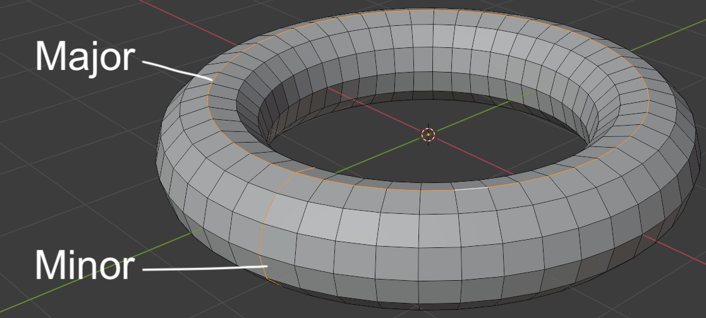

```{r setup, include=FALSE}
knitr::opts_chunk$set(echo = TRUE)
```

<div class="marginnote"> Primitives </div>

Wie bereits erwähnt werden wir vorwiegend mit Meshes arbeiten. In der Auswahl zum Hinzufügen werden verschiedene grundlegende Formen von Meshes zum Hinzufügen bereitgestellt. Diese grundlegenden Formen werden als Primitives bezeichnet.
Zu den grundlegenden Primitives gehören:

* Plane
* Cube
* Circle
* UV Sphere
* ICO Sphere
* Cilinder
* Cone
* Torus
* Grid
* Monkey

# Plane

<div class="marginnote"> Fläche </div>

Die Plane stellt eine das grundlegendste Primitive dar. Es handelt sich dabei lediglich um eine einzelne Fläche, bestehend aus vier Vertices und einem Face. Per Default hat die Plane eine Dimensionalität von 2x2x0 Metern.

# Cube

<div class="marginnote"> Würfel </div>

Der Cube entspricht dem Standardwürfel, den Blender bei der Default-Szene anzeigt. Im Grunde genommen Per Default hat der Würfel eine Dimensionalität von 2x2x2 Metern.

# Circle

<div class="marginnote"> Kreis </div>

Der Circle entspricht einem runden Kreis mit dem Radius von einem Meter, wodurch er eine Dimensionalität von 2x2x2 Metern innehat. Der Kreis besteht dabei lediglich aus mit Edges verbundenen Vertices, ohne eine innere Fläche. Allerdings kann im Kontext-Menü zum Hinzufügen des Kreises auch eine Füllfläche erstellt werden.

# UV Sphere
<div class="marginnote"> Kugel bestehend aus Quads </div>

Die UV-Sphere stellt eine Kugel dar, mit der Dimensionalität von 2x2x2 Metern. Die Kugel besteht aus Quads, wobei sie an den Endpunkten der Z-Achse durch Tris verbunden ist. Die Anzahl der Segmente um die Kugel herum, so wie die Anzahl Ringe lassen sich im Kontext-Menü beim Erstellen der Kugel einstellen. Die Segmente beschreiben dabei die Anzahl Vertice, welche ein Ring entlang der XY-Achse der Kugel beinhaltet, während die Anzahl Ringe beschreibt, wie oft die Kugel der Z-Achse entlang in Vertices unterteilt werden soll.

# ICO Sphere
<div class="marginnote"> Kugel bestehend aus Tris </div>

Die ICO-Sphere stellt ebenfalls eine Kugel dar, allerdings mit den Dimensionen 1.9x2x2Metern. Anders als die UV-Sphere stellen alle ihre Faces Tris dar. Dies hat den Vorteil, dass die Form der Faces über die ganze Kugel hinweg etwa gleichbleibt. Im Kontext-Menü zur Erstellung der ICO-Sphere kann mit der Anzahl Subdivisions eingestellt werden, wie oft die Dreiecke dieser Kugel unterteilt werden sollen. Mit zunehmenden Subdivisions nähert sich die X-Dimensionalität auch 2 Metern an.

# Cilinder

<div class="marginnote"> Zylinder </div>

Der Zylinder stellt zwei Kreise dar, welche jeweils mit Faces dazwischen verbunden sind. Seine Dimensionalität entspricht 2x2x2 Metern mit einem Radius der Kreise von 1 Meter. Im Kontext-Menü zur Erstellung des Zylinders lässt sich die Anzahl Vertices einstellen, welche den Kreis unterteilen. Zudem lässt sich hier analog zum Kreis, einstellen, ob die Kreisfläche mit einem Face versehen werden soll und mit welcher Art Faces.

# Cone

<div class="marginnote"> Kegel </div>

Der Kegel stellt einen Spezialfall des Zylinders dar, bei dem die Radien der beiden Enden variiert werden können und eines der beiden Enden einen Radius von 0 innehat. Auch hier kann wieder eingestellt werden, wie viele Vertices die Kreise unterteilen sollen und wie die Kreisflächen gestaltet werden sollen.

# Torus

<div class="marginnote"> Torus </div>

Der Torus stellt eine Ringförmige Gestalt dar, welche aus einer Major- und einer Minor-Komponente besteht. Die Major-Komponente beschreibt dabei den Kreis von der Vogelperspektive herab auf den Torus und die Minor-Komponente den Kreis, welcher sich aus dem Querschnitt des Torus ergibt. Für beide Komponenten kann die Anzahl Vertices über das Segment-Feld im Kontext-Menü eingegeben werden. Die Dimensionalität kann entweder auch hinsichtlich der Major- und Minor-Komponente festgelegt werden oder alternativ als der Radius des inneren und des äusseren Ringes.




# Grid

<div class="marginnote"> Gitternetz </div>

Das Grid stellt eine Alternative zur glatten Fläche dar. Diese ist allerdings bereits in weitere kleine Quads innerhalb der Fläche unterteilt. Im Kontext Menü lässt sich anhand der Subdivisions eingeben, wie viele Vertices das Gitternetz entlang der X- und der Y-Achse haben sollen. Die Dimensionalität des Grids ist analog zur Plane per Default 2x2x0 Meter.

# Monkey

<div class="marginnote"> Susanne </div>

Bei der Auswahl des Monkeys generiert Blender das Modell eines Affenkopfs. Dabei handelt es sich um Susanne, das Maskottchen von Blender.