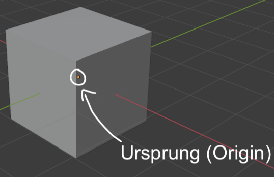
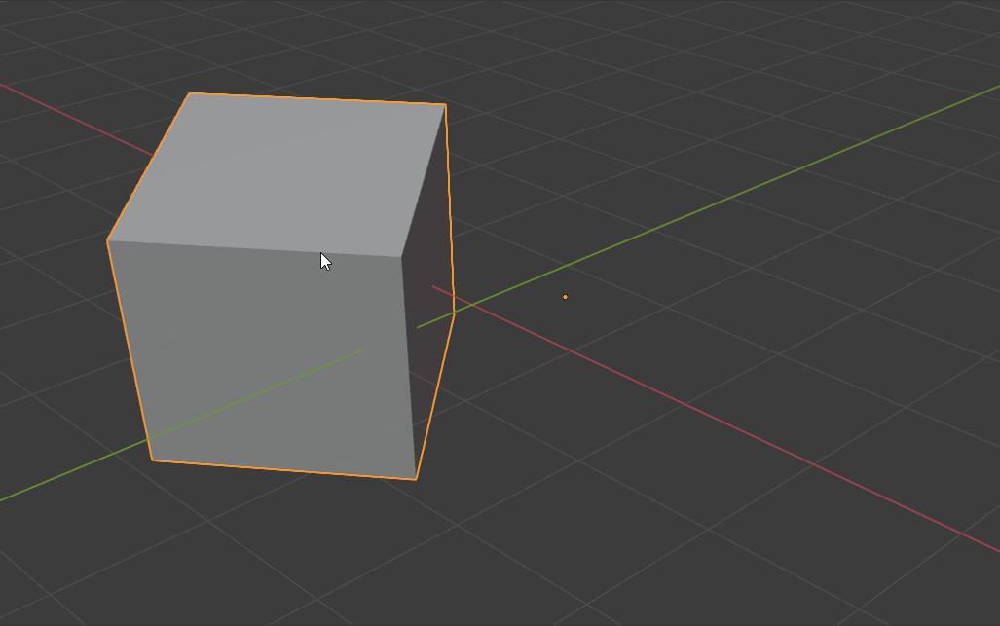

```{r setup, include=FALSE}
knitr::opts_chunk$set(echo = TRUE)
```

#Die drei grundlegenden Objekt-Transformationen

<div class="marginnote"> Grundlegende Transformationen </div>

Jegliche 3D-Meshes beinhalten drei grundlegende Eigenschaften. Diese Grundeigenschaften können manuell jederzeit variiert werden. Es handelt sich dabei um:

*   Position
*   Rotation 
*   Skalierung

Alle drei Optionen sind in der Sidebar (ein/ausblenden mittels <kbd>N</kbd>) unter dem Menü Item unter dem Reiter Transform sichtbar. Die Eigenschaften beziehen sich jeweils auf das ausgewählte Objekt. Wenn kein Objekt ausgewählt ist, beziehen sie sich auf das zuletzt ausgewählte Objekt. Mittels der Eigenschaften in der Sideview lassen sich diese drei Eigenschaften beliebig mittels der Eingabe von Zahlen variieren.

## Location

<div class="marginnote"> Position </div>

Die Location beschreibt die Position eines 3D-Meshes in der dreidimensionalen Welt. Die Position wird mittels drei Werten angegeben, einem Wert für die X-Achse, einem Wert für die Y-Achse und einem Wert für die Z-Achse. Jede dieser drei Werte lässt sich individuell verändern. Durch das Verschieben des X-Wertes verschiebt sich das Objekt beispielsweise der X-Achse entlang.

<div class="marginnote"> Position befindet sich am Ursprung des Objekts </div>

{width=25%}

Die genaue Position des Objektes wird anhand eines kleinen orangen Punktes im Viewport Display angezeigt. Bei diesem Punkt handelt es sich um den Ursprung des Objektes (Origin). Die Position eines Objektes bezieht sich immer auf diesen orangen Punkt, selbst wenn das Mesh selbst diese Position gar nicht abdeckt.

{width=50%}


##### ABBILDUNG 5 ######

## Rotation

<div class="marginnote"> Rotation </div>

Die Rotation eines Objektes beschreibt, wie sehr das Objekt entlang der drei Achsen rotiert wird. Analog zur Position ist die Rotation ebenfalls in die drei Achsen X, Y und Z aufgeteilt. Beispielsweise, eine Veränderung der Rotation beim Wert X führt dazu, dass das Objekt entsprechend entlang der X-Achse rotiert wird. Durch die Verwendung aller drei Achsen können so komplexe Rotationen erfolgen. Indem alle Werte erneut auf 0 gesetzt werden, befindet sich das Objekt wieder in seiner Grundposition.

{width=25%}

<div class="marginnote"> Drehpunkt der Rotation </div>

Der Ursprung des Objektes stellt den Drehpunkt für die Rotation mittels der Sidebar dar. Das heisst, die Objekte werden jeweils um den Ursprungspunkt herum rotiert. Dies wird beispielsweise deutlich, wenn sich der Ursprungspunkt ausserhalb eines Objektes befindet.

{width=25%}

## Scale

<div class="marginnote"> Skalierung </div>

Die Skalierung eines Objekts beschreibt, wie stark ein Objekt vergrössert oder verkleinert wird. Diese Objekt-Eigenschaft lässt sich ebenfalls individuell für alle drei Achsen einstellen. So kann ein Objekt entlang der X-Achse vergrössert werden, indem der dazugehörige X-Wert auf einen Wert über 1 festgelegt wird. Werte im Bereich von grösser als 0 und kleiner als 1 führen zu einer Verkleinerung des Objektes entlang der entsprechenden Achse. Ein Wert von 0 führt dazu, dass das Objekt entlang der entsprechenden Achse keine Grösse mehr hat und aus der entsprechenden Perspektive nicht mehr sichtbar ist. Die anderen Seiten sind allerdings noch sichtbar.

<div class="marginnote"> Bezugspunkt der Skalierung </div>

Analog zu der Position und der Rotation bezieht sich die Skalierung ebenfalls auf den Ursprung des Objektes. Wenn sich das Mesh ausserhalb des Ursprungs befindet führt dies dazu, dass auch der Leerraum zwischen dem Mesh und dem Ursprung entsprechend skaliert wird. Befindet sich die Grenze eines Objektes etwa um den Wert 1 vom Ursprung entfernt, führt eine Skalierung um den Wert 2 dazu, dass das Mesh selbst verdoppelt wird – allerdings wird die Distanz zum Ursprung des Objektes ebenfalls verdoppelt.

::: {.info  data-latex="{info}"}
Statt Zahlen können auch mathematische Berechnungen in die Felder eingegeben werden. Dadurch lassen sich beispielsweise komplexere Positionen ermitteln. Wenn etwa ein Objekt genau mittig zwischen einem Objekt mit einer Position von X = 4 und einem Objekt mit einer Position von X = 17 platziert werden soll, kann der X-Wert des zu platzierenden Objektes auf X = 4 + ((17 - 4) / 2) festgelegt werden. Das Objekt wird anschliessend mittig der beiden Objekte (X = 10.5) platziert.
:::


# Dimension

<div class="marginnote"> Dimensionen von Objekten </div>

Unterhalb des Eingabefeldes für die Skalierung befindet sich ein weiteres Feld, welches die Dimensionen eines 3D-Meshes basierend auf den drei Achsen angibt. Die Dimensionen des Objektes sind direkt mit der Skalierung des Objektes verbunden. Eine Veränderung der Dimensionen in die X-Achse führt dazu, dass die Skalierung anhand der X-Achse so angepasst wird, dass sie der eingegebenen Grösse des Objektes entsprechen. Dadurch kann etwa direkt bestimmt werden, dass ein Objekt entlang der verschiedenen Achsen eine bestimmte Grösse innehat, ohne dass die Skalierung der entsprechenden Grösse angepasst wird. Die Dimension des Objektes berücksichtigt anders als die Location, Rotation und Scale des Ursprungs des Objektes nicht. Unabhängig davon, ob sich der Ursprung des Objektes an derselben Stelle befindet wie das Objekt selbst, bezieht sich die Dimension des Objektes nur auf die Grösse des Objektes als solches.

# Transformationen sperren

<div class="marginnote"> Transformationen sperren </div>

Neben den Werten für die Location, Rotation und Scale befinden sich drei aufgeschlossene Schlösser. Durch das Anklicken dieser Schlösser lässt sich die dazugehörige Eigenschaft auf einer Achse sperren, so dass sie nicht mehr verändert werden kann. Das entsprechende Symbol verändert sich dadurch zu einem geschlossenen Schloss.
Sperrung gilt nicht für Viewport Display
Die Werte links neben dem Schloss lassen sich allerdings immer noch verändern. Dies mag kontraintuitiv wirken. Dies liegt daran, dass sich diese Sperrung auf Veränderungen mittels dem Viewport-Display beziehen, welche nun als nächstes betrachtet werden.

::: {.exercise  data-latex="{exercise}"}

# Übung 3: Verwendung der Sidebar
## Übung 3.1 
Versuchen Sie den Standardwürfel so zu skalieren, dass er einen in die Höhe ragenden Quader darstellt, entsprechend der Abbildung.

{width=15%}


## Übung 3.2 
Versuchen Sie den Standardwürfel so zu verändern, dass er aus der orthogonalen (Taste <kbd>5</kbd>) Vorder-/Rück-Ansicht (Taste <kbd>1</kbd>) und der Seitenansicht (Taste <kbd>3</kbd>) nicht mehr sichtbar ist.


## Übung 3.3 
Bilden sie das rechtsstehende Objekt nach.
 
ABBILDUNG

:::


::: {.remember  data-latex="{remember}"}

# Merke

*   Die drei Transformationen Location, Rotation und Scale aus der Sideview beziehen sich alle drei jeweils auf den Ursprung eines Objektes
*   Die Dimension des Objektes hängt mit dessen Skalierung zusammen und berücksichtig den Ursprung des Objektes nicht.

:::